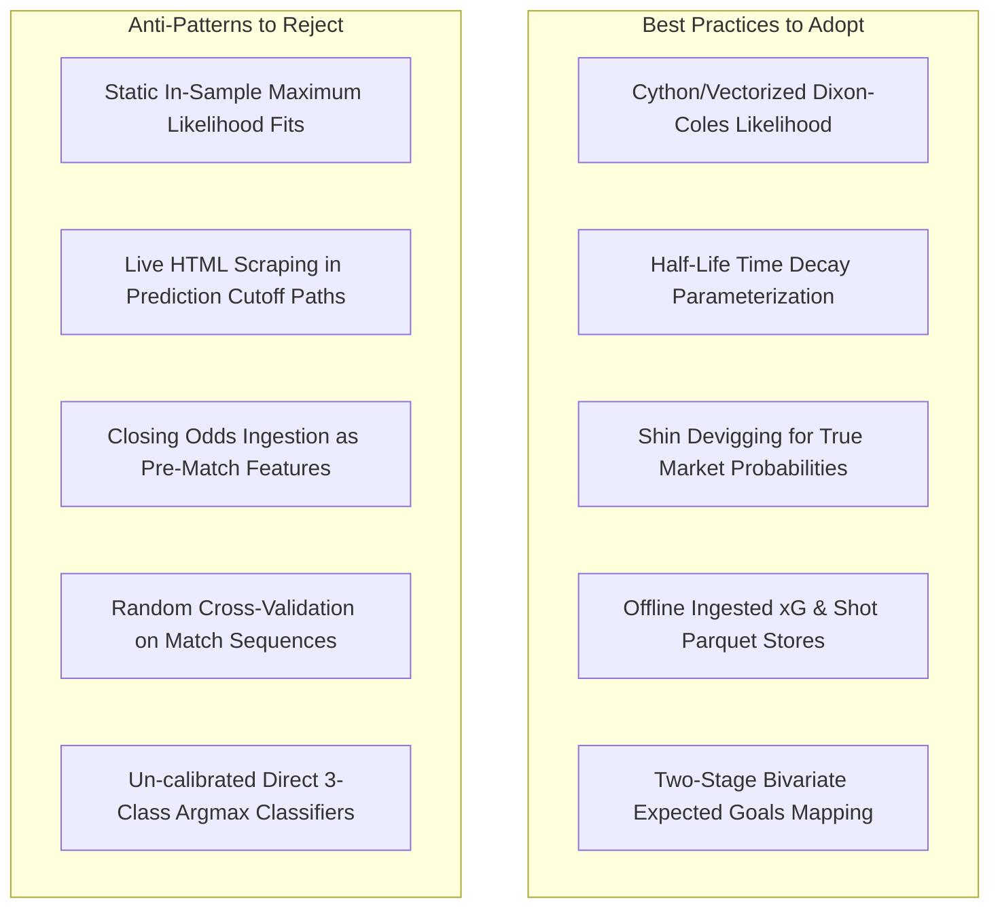

# 02 — GitHub & Open-Source Review: Football Analytics Repositories

## 1. Executive Summary

This review analyzes eight prominent open-source football analytics and forecasting repositories. We examine their architectural designs, feature engineering pipelines, distribution modeling, optimization methods, and common anti-patterns. 

Open-source codebases provide valuable algorithmic components (e.g., vectorized Dixon-Coles log-likelihood solvers, multi-method bookmaker devigging algorithms, standardized event parsers). However, **many public projects contain subtle causal bugs, including cross-split scaling leakage, retrospective rolling updates, and un-gated market odds ingestion**.

---

## 2. Detailed Repository Reviews

### Repository 1: `penaltyblog`
- **GitHub URL**: [https://github.com/martineastwood/penaltyblog](https://github.com/martineastwood/penaltyblog)
- **Stars**: ~850+ | **Language**: Python / Cython | **License**: MIT
- **Last Activity**: Active (2024–2026)
- **Architecture**:
  - Modular package for sports analytics, predictive modeling, and betting math.
  - Cython-optimized solvers for Dixon-Coles maximum likelihood estimation (MLE).
  - Multiple bookmaker margin removal (devigging) algorithms: Shin, Proportional (Multiplicative), Additive, Power, Odds-Ratio.
  - Poisson and Negative Binomial goal distribution models with exact score grid generation.
  - Bayesian Poisson regression wrappers using PyMC.
- **Dataset & Features**:
  - Connectors to `football-data.co.uk`, StatsBomb Open Data, and Understat.
  - Team attack strengths, defense strengths, home advantage, low-score dependency parameter $\rho$, time-decay parameter $\xi$.
- **Relevant Modules**:
  - `penaltyblog.models.DixonColesGoalModel`
  - `penaltyblog.implied.shin`
  - `penaltyblog.metrics.rps`
- **What We Can Learn**:
  - Highly optimized, vectorized implementation of the Dixon-Coles bivariate log-likelihood:
    $$\ln L(\alpha, \beta, \gamma, \rho) = \sum_{k=1}^N \left( \ln \tau_{\lambda_k, \mu_k}(x_k, y_k) - \lambda_k + x_k \ln \lambda_k - \mu_k + y_k \ln \mu_k \right)$$
  - Shin's method for extracting true market implied probabilities from 1X2 betting odds by solving for the insider-trading parameter $z$.
- **What We Should NOT Copy Blindly**:
  - The default `DixonColesGoalModel.fit()` in `penaltyblog` fits parameters statically over the entire dataset if not explicitly wrapped in a temporal walk-forward loop. We must enforce strict causal windowing.

---

### Repository 2: `socceraction`
- **GitHub URL**: [https://github.com/ML-KULeuven/socceraction](https://github.com/ML-KULeuven/socceraction)
- **Maintainer**: DTAI Sports Analytics Lab (KU Leuven)
- **Stars**: ~1,200+ | **Language**: Python | **License**: Apache 2.0
- **Last Activity**: Active (2025–2026)
- **Architecture**:
  - Python library for evaluating soccer event stream data.
  - Converts diverse vendor formats into **SPADL** (Soccer Player Action Description Language).
  - Implementation of **VAEP** (Valuing Actions by Estimating Probabilities) and Expected Threat ($xT$).
  - Machine learning pipelines using XGBoost and CatBoost to evaluate whether individual actions increase the probability of scoring or conceding in the subsequent 10 actions.
- **Dataset & Features**:
  - Event streams from StatsBomb, Opta, Wyscout.
  - Features: Action type, $(x, y)$ start/end coordinates, time delta, body part, previous 3-action sequence, home/away indicator, score differential.
- **Relevant Modules**:
  - `socceraction.spadl`
  - `socceraction.vaep`
  - `socceraction.xthreat`
- **What We Can Learn**:
  - How to aggregate granular actions (carries, progressive passes, pressures) into team-level pre-match attacking/defensive ratings.
  - Spatial feature engineering showing that **danger-zone box entries** and **high turnovers within 40m of goal** carry stronger predictive power than raw total possession.
- **What We Should NOT Copy Blindly**:
  - Action-level models require full event-stream feeds, which are heavy, expensive, and unavailable in free live feeds. We should extract the aggregated insights (e.g., dangerous attack rates and shot conversion ratios) rather than full SPADL pipelines for live matchday operation.

---

### Repository 3: `kloppy`
- **GitHub URL**: [https://github.com/PySport/kloppy](https://github.com/PySport/kloppy)
- **Maintainer**: PySport Community
- **Stars**: ~600+ | **Language**: Python | **License**: MIT
- **Last Activity**: Active (2025–2026)
- **Architecture**:
  - Standardized data deserializer and normalization layer for tracking and event data.
  - Provider adapters for Opta, StatsBomb, Sportec, Second Spectrum, Tracab, Hudl/Wyscout.
  - Pitch coordinate transformer (normalizes pitch dimensions to standard $[-0.5, 0.5]$ or $[0, 100]$ coordinate grids).
- **Dataset & Features**:
  - Raw tracking/event datasets from public and open repositories.
- **Relevant Modules**:
  - `kloppy.load_statsbomb_event_data`
  - `kloppy.load_opta_event_data`
  - `kloppy.domain.models`
- **What We Can Learn**:
  - Clean object-oriented provider abstraction for ingesting raw match events, matching our `src/data/providers/football_fixture_provider.py` architecture.
- **What We Should NOT Copy Blindly**:
  - Kloppy focuses on spatial coordinate transformations for in-match analytics, which is unnecessary overhead for 1X2 matchday outcome prediction.

---

### Repository 4: `regista`
- **GitHub URL**: [https://github.com/Torvaney/regista](https://github.com/Torvaney/regista)
- **Maintainer**: Ben Torvaney
- **Stars**: ~250+ | **Language**: R | **License**: MIT
- **Last Activity**: Stable
- **Architecture**:
  - R package designed for fitting Dixon-Coles and hierarchical Poisson models with modern `tidyverse` syntax.
  - Seamless time-decay weighting via half-life specifications ($\xi = \ln(2) / t_{1/2}$).
  - Simulation engine generating simulated league tables and match outcomes from Poisson joint distributions.
- **Dataset & Features**:
  - Standard league match records (date, home_team, away_team, home_goals, away_goals).
- **Relevant Modules**:
  - `regista::dixoncoles()`
  - `regista::dixoncoles_ext()`
- **What We Can Learn**:
  - Elegant parameterization of the time-decay parameter: expressing time weighting as a **half-life in weeks** (e.g., $t_{1/2} = 52\text{ weeks}$, meaning matches from 1 year ago carry 50% weight of today's matches) is more intuitive and robust than raw decay rates ($\xi = 0.0019$).
- **What We Should NOT Copy Blindly**:
  - R implementation relies on R's internal optimization (`optim` with BFGS/Nelder-Mead), which can be slow and unstable on small sample sizes. A custom gradient-based solver in Python/NumPy/SciPy is required for our production/research environment.

---

### Repository 5: `ScraperFC` & `understatapi`
- **GitHub URLs**: [https://github.com/oseda/ScraperFC](https://github.com/oseda/ScraperFC) / [https://github.com/colingow/understatapi](https://github.com/colingow/understatapi)
- **Stars**: ~450+ / ~150+ | **Language**: Python | **License**: MIT / GPL
- **Last Activity**: Active (2025–2026)
- **Architecture**:
  - Headless and API-based scraping utilities for open football analytics sites (Understat, FBref, Transfermarkt, ClubElo).
  - Extracts pre-match and post-match $xG$, shot coordinates, player match logs, injury records, and squad market values.
- **Dataset & Features**:
  - Top 5 European leagues (2014–2026).
  - Granular $xG$, $xGA$, $npxG$, deep completions, PPDA (passes allowed per defensive action), shots by situation (open play, corner, free kick, penalty).
- **Relevant Modules**:
  - `understatapi.UnderstatClient`
  - `ScraperFC.FBref`
  - `ScraperFC.ClubElo`
- **What We Can Learn**:
  - Reliable parsing patterns for acquiring historical $xG$ and advanced shot metrics without paying for commercial API tiers.
- **What We Should NOT Copy Blindly**:
  - Direct web scraping in real-time production inference introduces latency and brittleness (HTML schema drift, IP blocking). All scraped datasets must be ingested into local SQLite/Parquet stores offline with immutable checksums and schema validation before use in research/production.

---

### Repository 6: `worldcup_repo` (Internal Research Reference)
- **Path**: `research/worldcup_repo/`
- **Language**: Python | **Status**: Reproducible baseline
- **Architecture**:
  - International football prediction harness combining Elo ratings, confederation adjustments, Dixon-Coles parameters, and probability calibration.
  - Multi-season walk-forward backtesting (`src/backtest.py`, `src/dixon_coles.py`, `src/elo.py`, `src/calibrate.py`).
- **Dataset & Features**:
  - Complete international results (1872–present), confederation strength differentials, goalscorer data, historical tournament odds.
- **What We Can Learn**:
  - Clean separation of concerns between Elo feature generation (`src/elo.py`), probability calibration via Platt scaling / isotonic regression (`src/calibrate.py`), and scoring metrics (`src/metrics.py`).
  - Strict zero-leakage walk-forward evaluation protocol.
- **What We Should NOT Copy Blindly**:
  - International football dynamics (infrequent matches, extreme confederation gaps, neutral venues) differ substantially from domestic 5-league club football (high frequency, static home venues, balanced rosters).

---

## 3. Cross-Repository Synthesis: Best Practices vs. Anti-Patterns

---

## 4. Key Takeaways for the $V_5$ Pipeline

1. **Adopt Vectorized Dixon-Coles & Shin Devigging**: Utilize mathematical formulas validated in `penaltyblog` to implement fast, exact low-score inflation and bookmaker margin removal.
2. **Standardize Time Decay as Half-Life**: Parameterize rolling decay using half-life in weeks ($t_{1/2} = 26\text{ to }52\text{ weeks}$) rather than arbitrary exponential decay coefficients.
3. **Isolate Data Ingestion from Inference**: All external data (Understat $xG$, historical closing odds, shot coordinates) must be compiled into static, version-controlled SQLite/Parquet research tables with timestamp metadata prior to training.
