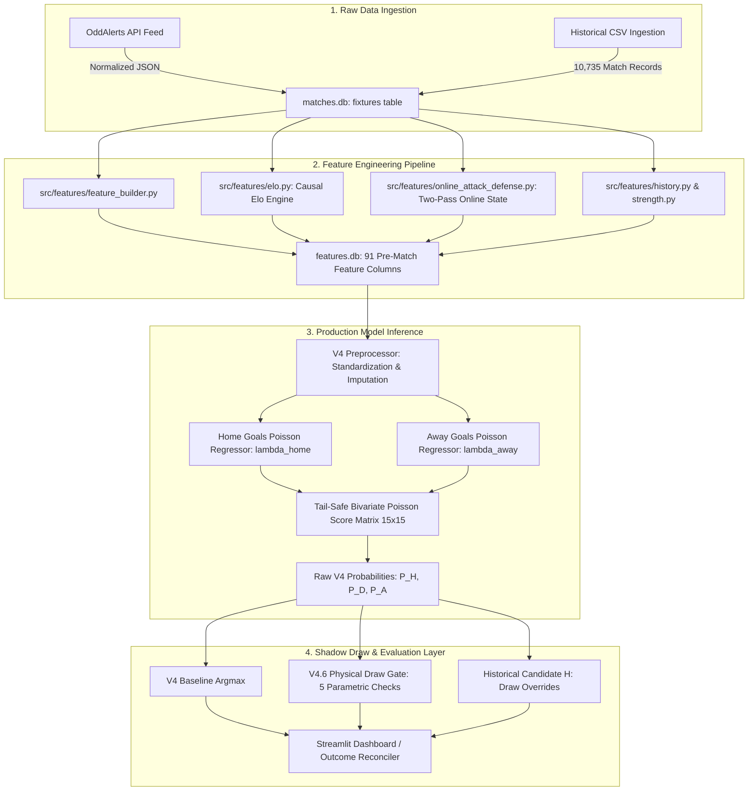

# 04 — Current Feature Inventory: Complete Production Pipeline Audit

## 1. Executive Summary

This document establishes the authoritative inventory of all **91 features** currently utilized by the production $V_4$ Poisson model ([`data/models/v4_poisson_venue_elo_online_ad.pkl`](file:///e:/Football%20Prediction%20Project/data/models/v4_poisson_venue_elo_online_ad.pkl)). 

We trace the complete data lifecycle:
$$\text{Raw Feed / DB} \longrightarrow \text{Feature Builder} \longrightarrow \text{Features DB} \longrightarrow V_4\text{ Artifact} \longrightarrow \text{Prediction Service} \longrightarrow V_{4.2}/V_{4.6}\text{ Gates} \longrightarrow \text{Evaluation}$$

Every feature is cataloged with its mathematical definition, historical window, pre-match causal validity, leakage assessment, and optimization potential for $V_5$.

---

## 2. Complete End-to-End Pipeline Architecture Trace

---

## 3. Systematic 91-Feature Inventory Matrix

### Group A: Rolling Goal Statistics (18 Features)
*Source: `src/features/rolling.py` & `src/features/feature_builder.py` | Causal: Yes | Pre-match: Yes*

| Index | Feature Name | Type | Window | Definition / Mathematical Formula | Leakage Risk | Current Model Usage | Potential $V_5$ Improvement |
|:---:|:---|:---:|:---:|:---|:---:|:---|:---|
| `[00]` | `home_goals_for_per_match_last5` | Float | 5 matches | Mean goals scored by Home team in last 5 matches | Zero | Linear input to $\lambda_H, \lambda_A$ | Replace/augment with rolling $xG_{\text{last 5}}$ |
| `[01]` | `home_goals_against_per_match_last5` | Float | 5 matches | Mean goals conceded by Home team in last 5 matches | Zero | Linear input to $\lambda_H, \lambda_A$ | Replace/augment with rolling $xGA_{\text{last 5}}$ |
| `[02]` | `home_goals_diff_last5` | Float | 5 matches | `home_goals_for_last5 - home_goals_against_last5` | Zero | Linear input to $\lambda_H, \lambda_A$ | Exponentially weighted ($EWMA$) goal diff |
| `[03]` | `home_goals_for_per_match_last10` | Float | 10 matches | Mean goals scored by Home team in last 10 matches | Zero | Linear input to $\lambda_H, \lambda_A$ | Longer-term baseline stability |
| `[04]` | `home_goals_against_per_match_last10` | Float | 10 matches | Mean goals conceded by Home team in last 10 matches | Zero | Linear input to $\lambda_H, \lambda_A$ | Opponent-quality adjusted concession |
| `[05]` | `home_goals_diff_last10` | Float | 10 matches | `home_goals_for_last10 - home_goals_against_last10` | Zero | Linear input to $\lambda_H, \lambda_A$ | $xG$ difference over 10 matches |
| `[06]` | `home_goals_for_per_match_season` | Float | Season | Cumulative mean goals scored in current season | Zero | Linear input to $\lambda_H, \lambda_A$ | Handle early season ($\le 3$ games) shrinkage |
| `[07]` | `home_goals_against_per_match_season` | Float | Season | Cumulative mean goals conceded in current season | Zero | Linear input to $\lambda_H, \lambda_A$ | Bayesian prior shrinkage for small $N$ |
| `[08]` | `home_goals_diff_season` | Float | Season | Cumulative season goal differential | Zero | Linear input to $\lambda_H, \lambda_A$ | Cross-season blended shrinkage |
| `[09]` | `away_goals_for_per_match_last5` | Float | 5 matches | Mean goals scored by Away team in last 5 matches | Zero | Linear input to $\lambda_H, \lambda_A$ | Rolling $xG$ for Away team |
| `[10]` | `away_goals_against_per_match_last5` | Float | 5 matches | Mean goals conceded by Away team in last 5 matches | Zero | Linear input to $\lambda_H, \lambda_A$ | Rolling $xGA$ for Away team |
| `[11]` | `away_goals_diff_last5` | Float | 5 matches | `away_goals_for_last5 - away_goals_against_last5` | Zero | Linear input to $\lambda_H, \lambda_A$ | Opponent strength weighted form |
| `[12]` | `away_goals_for_per_match_last10` | Float | 10 matches | Mean goals scored by Away team in last 10 matches | Zero | Linear input to $\lambda_H, \lambda_A$ | Longer-term baseline stability |
| `[13]` | `away_goals_against_per_match_last10` | Float | 10 matches | Mean goals conceded by Away team in last 10 matches | Zero | Linear input to $\lambda_H, \lambda_A$ | Opponent-quality adjusted concession |
| `[14]` | `away_goals_diff_last10` | Float | 10 matches | `away_goals_for_last10 - away_goals_against_last10` | Zero | Linear input to $\lambda_H, \lambda_A$ | $xG$ difference over 10 matches |
| `[15]` | `away_goals_for_per_match_season` | Float | Season | Cumulative mean goals scored by Away team | Zero | Linear input to $\lambda_H, \lambda_A$ | Bayesian prior shrinkage |
| `[16]` | `away_goals_against_per_match_season` | Float | Season | Cumulative mean goals conceded by Away team | Zero | Linear input to $\lambda_H, \lambda_A$ | Bayesian prior shrinkage |
| `[17]` | `away_goals_diff_season` | Float | Season | Cumulative season goal differential | Zero | Linear input to $\lambda_H, \lambda_A$ | Cross-season blended shrinkage |

---

### Group B: Points, Win/Draw/Loss Rates & Form (20 Features)
*Source: `src/features/form.py` | Causal: Yes | Pre-match: Yes*

| Index | Feature Name | Type | Window | Definition / Mathematical Formula | Leakage Risk | Current Model Usage | Potential $V_5$ Improvement |
|:---:|:---|:---:|:---:|:---|:---:|:---|:---|
| `[18]` | `home_points_last5` | Float | 5 matches | Total points earned (3 for W, 1 for D) in last 5 matches | Zero | Form indicator | Points per game weighted by opponent Elo |
| `[19]` | `home_win_rate_last5` | Float | 5 matches | Fraction of wins in last 5 matches | Zero | Form indicator | Non-linear streak acceleration |
| `[20]` | `home_draw_rate_last5` | Float | 5 matches | Fraction of draws in last 5 matches | Zero | Form indicator | Draw tendency index |
| `[21]` | `home_loss_rate_last5` | Float | 5 matches | Fraction of losses in last 5 matches | Zero | Form indicator | Crisis/slump index |
| `[22]` | `home_goal_diff_last5` | Float | 5 matches | Goal difference across last 5 matches | Zero | Form indicator | $xG$ difference |
| `[23]` | `home_points_last10` | Float | 10 matches | Total points earned in last 10 matches | Zero | Form indicator | Long-term form stability |
| `[24]` | `home_win_rate_last10` | Float | 10 matches | Fraction of wins in last 10 matches | Zero | Form indicator | Smooth form curve |
| `[25]` | `home_draw_rate_last10` | Float | 10 matches | Fraction of draws in last 10 matches | Zero | Form indicator | Tactical draw conservatism index |
| `[26]` | `home_loss_rate_last10` | Float | 10 matches | Fraction of losses in last 10 matches | Zero | Form indicator | Relegation risk index |
| `[27]` | `home_goal_diff_last10` | Float | 10 matches | Goal difference across last 10 matches | Zero | Form indicator | Smooth $xG$ differential |
| `[28]` | `away_points_last5` | Float | 5 matches | Total points earned by Away team in last 5 matches | Zero | Form indicator | Opponent-adjusted away form |
| `[29]` | `away_win_rate_last5` | Float | 5 matches | Fraction of wins for Away team in last 5 matches | Zero | Form indicator | Away form momentum |
| `[30]` | `away_draw_rate_last5` | Float | 5 matches | Fraction of draws for Away team in last 5 matches | Zero | Form indicator | Tactical conservatism index |
| `[31]` | `away_loss_rate_last5` | Float | 5 matches | Fraction of losses for Away team in last 5 matches | Zero | Form indicator | Road vulnerability index |
| `[32]` | `away_goal_diff_last5` | Float | 5 matches | Goal difference for Away team in last 5 matches | Zero | Form indicator | Away $xG$ differential |
| `[33]` | `away_points_last10` | Float | 10 matches | Total points earned by Away team in last 10 matches | Zero | Form indicator | Long-term away stability |
| `[34]` | `away_win_rate_last10` | Float | 10 matches | Fraction of wins for Away team in last 10 matches | Zero | Form indicator | Away class tiering |
| `[35]` | `away_draw_rate_last10` | Float | 10 matches | Fraction of draws for Away team in last 10 matches | Zero | Form indicator | Away draw tendency |
| `[36]` | `away_loss_rate_last10` | Float | 10 matches | Fraction of losses for Away team in last 10 matches | Zero | Form indicator | High-risk road profile |
| `[37]` | `away_goal_diff_last10` | Float | 10 matches | Goal difference for Away team in last 10 matches | Zero | Form indicator | Away $xG$ trend |

---

### Group C: Historical Strength Scores & Competition (6 Features)
*Source: `src/features/strength.py` & `src/features/context.py` | Causal: Yes | Pre-match: Yes*

| Index | Feature Name | Type | Window | Definition / Mathematical Formula | Leakage Risk | Current Model Usage | Potential $V_5$ Improvement |
|:---:|:---|:---:|:---:|:---|:---:|:---|:---|
| `[38]` | `home_attack_strength_score` | Float | Historical | Relative league scoring rate ($G_{\text{home}} / \bar{G}_{\text{league}}$) | Zero | Baseline capacity | Replace static with dynamic $xG$ attack |
| `[39]` | `home_defence_strength_score` | Float | Historical | Relative league concession rate ($GA_{\text{home}} / \bar{G}_{\text{league}}$) | Zero | Baseline capacity | Dynamic $xGA$ defense |
| `[40]` | `away_attack_strength_score` | Float | Historical | Relative league away scoring rate ($G_{\text{away}} / \bar{G}_{\text{league}}$) | Zero | Baseline capacity | Dynamic away $xG$ strength |
| `[41]` | `away_defence_strength_score` | Float | Historical | Relative league away concession rate ($GA_{\text{away}} / \bar{G}_{\text{league}}$) | Zero | Baseline capacity | Dynamic away $xGA$ defense |
| `[42]` | `strength_diff` | Float | Historical | `(home_att - away_def) - (away_att - home_def)` | Zero | Match mismatch measure | Non-linear strength interaction |
| `[43]` | `competition_id` | Int | Static | League identifier (`423, 419, 477, 499, 200`) | Zero | Categorical grouping | League-specific base goal intensity |

---

### Group D: Total Shots Rolling Statistics (18 Features)
*Source: `src/features/rolling.py` | Causal: Yes | Pre-match: Yes*

| Index | Feature Name | Type | Window | Definition / Mathematical Formula | Leakage Risk | Current Model Usage | Potential $V_5$ Improvement |
|:---:|:---|:---:|:---:|:---|:---:|:---|:---|
| `[44]`–`[52]` | `home_shots_for/against/diff` (last5, last10, season) | Float | 5, 10, Season | Mean total shots generated and conceded per match by Home team | Zero | Proxy for match dominance | Filter down to high-quality shots (box shots) |
| `[53]`–`[61]` | `away_shots_for/against/diff` (last5, last10, season) | Float | 5, 10, Season | Mean total shots generated and conceded per match by Away team | Zero | Proxy for match dominance | Weight by shot distance/location |

---

### Group E: Shots on Target Rolling Statistics (18 Features)
*Source: `src/features/rolling.py` | Causal: Yes | Pre-match: Yes*

| Index | Feature Name | Type | Window | Definition / Mathematical Formula | Leakage Risk | Current Model Usage | Potential $V_5$ Improvement |
|:---:|:---|:---:|:---:|:---|:---:|:---|:---|
| `[62]`–`[70]` | `home_shots_on_for/against/diff` (last5, last10, season) | Float | 5, 10, Season | Mean shots on target generated and conceded per match by Home team | Zero | High-precision attack/defense indicator | Shot-on-target conversion efficiency ($SOT\%$) |
| `[71]`–`[79]` | `away_shots_on_for/against/diff` (last5, last10, season) | Float | 5, 10, Season | Mean shots on target generated and conceded per match by Away team | Zero | High-precision attack/defense indicator | Shot-on-target conversion efficiency ($SOT\%$) |

---

### Group F: Venue-Specific Season Goal Rates (4 Features)
*Source: `src/features/feature_builder.py` | Causal: Yes | Pre-match: Yes*

| Index | Feature Name | Type | Window | Definition / Mathematical Formula | Leakage Risk | Current Model Usage | Potential $V_5$ Improvement |
|:---:|:---|:---:|:---:|:---|:---:|:---|:---|
| `[80]` | `home_goals_for_home_venue_season` | Float | Season | Mean goals scored by Home team exclusively in home matches | Zero | Home pitch scoring capacity | Shrinkage to team overall mean in early rounds |
| `[81]` | `home_goals_against_home_venue_season` | Float | Season | Mean goals conceded by Home team exclusively in home matches | Zero | Home pitch defensive resilience | Shrinkage to team overall mean in early rounds |
| `[82]` | `away_goals_for_away_venue_season` | Float | Season | Mean goals scored by Away team exclusively in away matches | Zero | Road scoring capacity | Shrinkage to team overall mean in early rounds |
| `[83]` | `away_goals_against_away_venue_season` | Float | Season | Mean goals conceded by Away team exclusively in away matches | Zero | Road defensive vulnerability | Shrinkage to team overall mean in early rounds |

---

### Group G: Causal Elo Ratings (3 Features)
*Source: `src/features/elo.py` (Experiment $E_1$) | Causal: Yes | Pre-match: Yes*

| Index | Feature Name | Type | Window | Definition / Mathematical Formula | Leakage Risk | Current Model Usage | Potential $V_5$ Improvement |
|:---:|:---|:---:|:---:|:---|:---:|:---|:---|
| `[84]` | `home_elo` | Float | Lifetime | Sequential Elo rating ($K=20, H_{\text{adv}}=100, R_0=1500$) | Zero | Core team strength anchor | Margin-of-victory goal weighting |
| `[85]` | `away_elo` | Float | Lifetime | Sequential Elo rating ($K=20, H_{\text{adv}}=100, R_0=1500$) | Zero | Core team strength anchor | Margin-of-victory goal weighting |
| `[86]` | `elo_diff` | Float | Pre-Match | `home_elo - away_elo + home_advantage` | Zero | Primary linear predictor of goal expectation | Quadratic Elo interaction ($\Delta R^2$) |

---

### Group H: Online Attack / Defense Dynamic State (4 Features)
*Source: `src/features/online_attack_defense.py` (Experiment $E_6$) | Causal: Yes | Pre-match: Yes*

| Index | Feature Name | Type | Window | Definition / Mathematical Formula | Leakage Risk | Current Model Usage | Potential $V_5$ Improvement |
|:---:|:---|:---:|:---:|:---|:---:|:---|:---|
| `[87]` | `A_home` | Float | Lifetime | Recursive Poisson gradient update of Home team offensive ability | Zero | Direct log-linear offset to $\lambda_H$ | $xG$-informed gradient updates |
| `[88]` | `D_home` | Float | Lifetime | Recursive Poisson gradient update of Home team defensive vulnerability | Zero | Direct log-linear offset to $\lambda_A$ | $xGA$-informed gradient updates |
| `[89]` | `A_away` | Float | Lifetime | Recursive Poisson gradient update of Away team offensive ability | Zero | Direct log-linear offset to $\lambda_A$ | $xG$-informed gradient updates |
| `[90]` | `D_away` | Float | Lifetime | Recursive Poisson gradient update of Away team defensive vulnerability | Zero | Direct log-linear offset to $\lambda_H$ | $xGA$-informed gradient updates |

---

## 4. Pipeline Vulnerability & Feature Limitation Audit

1. **High Redundancy Across Window Sizes**:
   - `last5`, `last10`, and `season` goal and shot features exhibit severe collinearity (Pearson $r > 0.88$). In linear Poisson regression, this causes coefficient inflation and instability.
2. **Missing True Shot Quality ($xG$)**:
   - Total shots (e.g. 20 shots from 35 yards) are treated with equal weight to close-range opportunities. Introducing $xG$ directly addresses this limitation.
3. **No Representation of Fixture Congestion & Rest**:
   - The current 91 features have zero awareness of whether a team played 3 days ago in the Champions League or had a 14-day international break.
4. **No Direct Representation of Tactical Parity**:
   - Draw predictions rely entirely on the overlap of $(\lambda_H, \lambda_A)$ in the Poisson matrix. Features measuring tactical symmetry (e.g. low combined shot volume, mutual low pace) are missing from the primary feature vector.
