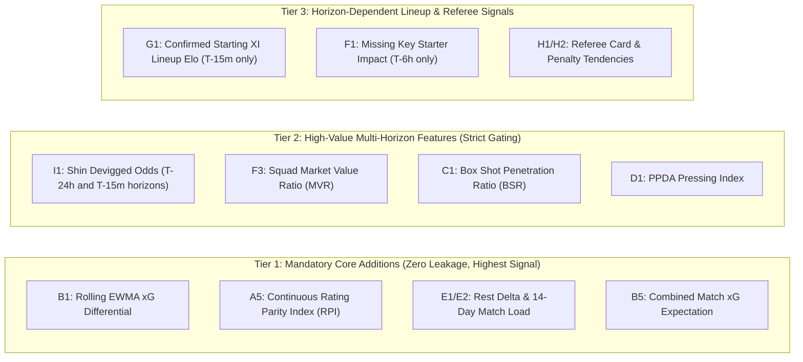

# 05 — Candidate Feature Matrix: Research-Backed Feature Expansions

## 1. Executive Summary

This document formalizes the candidate feature expansions for the $V_5$ football forecasting research program. We evaluate 10 major domain areas across physical team dynamics, advanced ball-tracking statistics, schedule fatigue, tactical interactions, and market information.

Every candidate feature is analyzed for:
1. **Mathematical Definition & Signal Hypothesis**
2. **Pre-Match Availability & Information Horizon**
3. **Historical Data Source (Free / Open Access)**
4. **Causal Leakage Risk & Mitigation Rule**
5. **Expected Improvement on $H / D / A$ and Draw-Specific Quality**

---

## 2. Comprehensive Candidate Feature Catalog

### Category A: Advanced Team Strength & Rating Dynamics

| Candidate Feature | Formula / Definition | Information Horizon | Primary Source | Leakage Risk | Expected Value on 1X2 & Draw |
|:---|:---|:---:|:---:|:---:|:---|
| **$A_1$: Glicko-2 Rating & RD** | Dynamic rating with Rating Deviation ($\sigma_{\text{RD}}$) measuring team volatility/uncertainty | $T-24\text{h}$ | Computed from historical results | Zero (Post-match recursive) | **High**: $\sigma_{\text{RD}}$ explicitly identifies early-season or promoted-team uncertainty. |
| **$A_2$: Opponent-Adjusted Elo** | Elo updates scaled by opponent strength at the time of the match ($K \cdot (\text{Score} - E)$) | $T-24\text{h}$ | Internal Elo Engine | Zero | **High**: Prevents flat-track bullies from inflating ratings against bottom-tier clubs. |
| **$A_3$: Home/Away Isolated Elo ($\pi$-Style)** | Separate ratings $R_{\text{home\_team}}^{\text{venue}}, R_{\text{away\_team}}^{\text{venue}}$ | $T-24\text{h}$ | Internal recursive engine | Zero | **Very High**: Captures venue-specific mental resilience and crowd impact. |
| **$A_4$: Strength Momentum / Acceleration** | Second derivative of Elo rating: $\Delta^2 R = (R_t - R_{t-5}) - (R_{t-5} - R_{t-10})$ | $T-24\text{h}$ | Internal Elo Engine | Zero | **Moderate**: Flags teams in sharp ascent or crisis slumps. |
| **$A_5$: Rating Parity Index ($RPI$)** | $RPI = \exp\left(-\frac{(R_H - R_A)^2}{2\sigma_{\text{parity}}^2}\right) \in [0, 1]$ | $T-24\text{h}$ | Internal Elo Engine | Zero | **Crucial for Draw**: Smooth continuous measure of team rating balance. |

---

### Category B: Expected Goals ($xG$) & Quality Metrics

| Candidate Feature | Formula / Definition | Information Horizon | Primary Source | Leakage Risk | Expected Value on 1X2 & Draw |
|:---|:---|:---:|:---:|:---|:---|
| **$B_1$: Rolling $xG$ Differential (EWMA)** | $\sum_{k=1}^N w_k (xG_k - xGA_k)$ with half-life $t_{1/2}=5\text{ games}$ | $T-24\text{h}$ | Understat / FBref | High if post-match leaked; Zero if causally lagged | **Very High**: Replaces noisy goal counts with stable chance creation rates. |
| **$B_2$: Non-Penalty $xG$ ($npxG$)** | $xG_{\text{total}} - xG_{\text{penalties}}$ (removes 0.79 $xG$ penalty spikes) | $T-24\text{h}$ | Understat | Zero if lagged | **High**: Eliminates referee penalty noise from team strength estimation. |
| **$B_3$: Finishing Overperformance ($\Delta_{\text{finish}}$)** | $\text{Goals}_{\text{scored}} - xG_{\text{created}}$ over rolling 10 matches | $T-24\text{h}$ | Understat | Zero if lagged | **High**: Detects unsustainable finishing hot streaks destined for mean reversion. |
| **$B_4$: Goalkeeper Shot-Stopping ($\Delta_{\text{GK}}$)** | $PSxG - \text{Goals Conceded}$ (Post-Shot $xG$ saved above expected) | $T-24\text{h}$ | Understat / FBref | Zero if lagged | **Moderate/High**: Quantifies world-class vs liability goalkeeping form. |
| **$B_5$: Combined Match $xG$ Expectation ($xG_{\text{sum}}$)** | $xG_{\text{home\_exp}} + xG_{\text{away\_exp}}$ derived from rolling $xG$ intensities | $T-24\text{h}$ | Internal $xG$ model | Zero | **Crucial for Draw**: Low $xG_{\text{sum}} \le 2.20$ strongly correlates with draws. |

---

### Category C: High-Precision Shot & Box Activity

| Candidate Feature | Formula / Definition | Information Horizon | Primary Source | Leakage Risk | Expected Value on 1X2 & Draw |
|:---|:---|:---:|:---:|:---|:---|
| **$C_1$: Box Shot Ratio ($BSR$)** | $\frac{\text{Shots Inside 18-Yard Box}}{\text{Total Shots}}$ | $T-24\text{h}$ | Football-Data / Understat | Zero if lagged | **Moderate**: Differentiates high-quality territorial penetration from speculative long shots. |
| **$C_2$: Shot Conversion Efficiency ($SCE$)** | $\frac{\text{Shots on Target}}{\text{Total Shots Conceded}}$ | $T-24\text{h}$ | Football-Data.co.uk | Zero if lagged | **Moderate**: Measures attacking sharpness and defensive compactness. |
| **$C_3$: Deep Completions Allowed ($DCA$)** | Passes completed within 20 yards of penalty box per match | $T-24\text{h}$ | Understat | Zero if lagged | **High**: Strongest proxy for defensive territorial collapse. |

---

### Category D: Tactical Style & Pressing Dynamics

| Candidate Feature | Formula / Definition | Information Horizon | Primary Source | Leakage Risk | Expected Value on 1X2 & Draw |
|:---|:---|:---:|:---:|:---|:---|
| **$D_1$: Passes Allowed Per Defensive Action ($PPDA$)** | $\frac{\text{Opponent Passes in Defensive 60\%}}{\text{Tackles + Interceptions + Challenges}}$ | $T-24\text{h}$ | Understat | Zero if lagged | **High**: Quantifies high-pressing intensity vs low-block tactical style. |
| **$D_2$: Tactical Style Matchup ($\Delta_{\text{style}}$)** | High-Press vs Low-Block interaction vector | $T-24\text{h}$ | Understat aggregates | Zero if lagged | **Moderate/High**: Identifies asymmetric stylistic vulnerabilities (e.g. counter-attack traps). |
| **$D_3$: Dangerous Attack Ratio ($DAR$)** | $\frac{\text{Dangerous Attacks}}{\text{Total Attacks}}$ per match | $T-24\text{h}$ | OddAlerts / matches.db | Zero if lagged | **Moderate**: Measures directness of offensive transitions. |

---

### Category E: Schedule Fatigue, Congestion, & Rest

| Candidate Feature | Formula / Definition | Information Horizon | Primary Source | Leakage Risk | Expected Value on 1X2 & Draw |
|:---|:---|:---:|:---:|:---|:---|
| **$E_1$: Rest Delta ($\Delta_{\text{rest}}$)** | $\text{Days Since Last Match}_{\text{Home}} - \text{Days Since Last Match}_{\text{Away}}$ | $T-24\text{h}$ | Fixture Schedule DB | Zero (Calendar deterministic) | **High**: 3 days rest vs 7 days rest causes measurable second-half physical drop-off. |
| **$E_2$: 14-Day Match Load ($ML_{14}$)** | Total competitive matches played in previous 14 calendar days | $T-24\text{h}$ | Fixture Schedule DB | Zero | **High**: Captures acute squad fatigue during European/Cup mid-week congestion. |
| **$E_3$: Travel Burden Index ($TBI$)** | Distance traveled (km) for Away team + short turnaround penalty | $T-24\text{h}$ | Geographic coordinates | Zero | **Moderate**: Particularly significant for European away games followed by domestic away trips. |
| **$E_4$: Consecutive Road Games ($CRG$)** | Count of consecutive away fixtures without returning to home ground | $T-24\text{h}$ | Fixture Schedule DB | Zero | **Moderate**: Road fatigue compounding. |

---

### Category F: Player Availability & Squad Valuation

| Candidate Feature | Formula / Definition | Information Horizon | Primary Source | Leakage Risk | Expected Value on 1X2 & Draw |
|:---|:---|:---:|:---:|:---|:---|
| **$F_1$: Missing Starter Share ($MSS$)** | % of regular XI minutes missing due to injury/suspension | $T-6\text{h}$ | Transfermarkt / News | **HIGH**: Must verify pre-match report timestamp | **High**: Heavy missing core ($\ge 3$ regular starters) degrades team rating by ~60 Elo. |
| **$F_2$: Goalkeeper Starter Missing ($GSM$)** | Binary indicator if primary goalkeeper is absent ($1/0$) | $T-6\text{h}$ | Official squad reports | **HIGH**: Verify timestamp | **Moderate/High**: Backup keepers concede +0.25 goals/match on average. |
| **$F_3$: Squad Market Value Ratio ($MVR$)** | $\ln(\text{Squad Value}_{\text{Home}} / \text{Squad Value}_{\text{Away}})$ | $T-24\text{h}$ | Transfermarkt (Seasonal) | Zero if frozen seasonally | **Very High**: Acts as the ultimate long-term baseline anchor for club quality. |

---

### Category G: Lineups & Tactical Formations

| Candidate Feature | Formula / Definition | Information Horizon | Primary Source | Leakage Risk | Expected Value on 1X2 & Draw |
|:---|:---|:---:|:---:|:---|:---|
| **$G_1$: Confirmed Lineup Elo ($R_{\text{lineup}}$)** | Sum of individual player ratings for the confirmed starting XI | $T-15\text{m}$ (Post-lineup release) | Official Match Sheets | **CRITICAL**: Confirmed only 60m before kickoff | **High** (at $T-15\text{m}$ horizon), **Zero** (at $T-24\text{h}$ horizon). |
| **$G_2$: Formation System Change ($FSC$)** | Indicator if team switches from standard system (e.g. 4-3-3 to 5-3-2) | $T-15\text{m}$ | Match Lineup Sheet | **CRITICAL**: Available only at $T-1\text{h}$ | **Moderate**: Flags defensive bunker setups in tough away fixtures. |

---

### Category H: Disciplinary & Referee Tendencies

| Candidate Feature | Formula / Definition | Information Horizon | Primary Source | Leakage Risk | Expected Value on 1X2 & Draw |
|:---|:---|:---:|:---:|:---|:---|
| **$H_1$: Referee Card Strictness ($RCS$)** | Referee historical Yellow/Red cards per match minus league mean | $T-24\text{h}$ | Football-Data.co.uk | Zero (Historical lagging) | **Moderate**: Strict referees increase foul stoppages and card frequency. |
| **$H_2$: Referee Penalty Rate ($RPR$)** | Penalties awarded per match by designated referee | $T-24\text{h}$ | Football-Data.co.uk | Zero | **Moderate**: Affects overall expected goal baseline. |
| **$H_3$: Referee Home Bias Coefficient ($RHB$)** | Difference in foul/card rates between home and away teams under referee | $T-24\text{h}$ | Football-Data.co.uk | Zero | **Low**: Mostly absorbed by team-level home advantage parameters. |

---

### Category I: Multi-Horizon Market Information & Implied Probabilities

| Candidate Feature | Formula / Definition | Information Horizon | Primary Source | Leakage Risk | Expected Value on 1X2 & Draw |
|:---|:---|:---:|:---:|:---|:---|
| **$I_1$: Shin Devigged Implied Probabilities** | $P_{\text{Shin}}(H), P_{\text{Shin}}(D), P_{\text{Shin}}(A)$ extracted from 1X2 odds | $T-24\text{h}$ (Opening) / $T-15\text{m}$ (Pre-KO) | Football-Data / OddAlerts | **CRITICAL**: Must match exact prediction horizon | **Very High**: Acts as the highest-information external benchmark ($E_2$). |
| **$I_2$: Market Draw Sentiment ($MDS$)** | Devigged market draw probability minus baseline model draw probability | $T-24\text{h}$ / $T-15\text{m}$ | Market odds vs $V_4$ | High if closing odds used; Low if horizon matched | **High for Draw**: Highlights market awareness of unmodeled draw dynamics. |
| **$I_3$: Market Odds Movement Velocity ($\Delta_{\text{odds}}$)** | $\ln(\text{Odds}_{T-15\text{m}} / \text{Odds}_{T-24\text{h}})$ (Smart-money price shift) | $T-15\text{m}$ | OddAlerts / Historical odds | **CRITICAL**: Requires opening AND pre-KO snapshots | **High**: Strongest proxy for late breaking news (lineups, injuries, sharp volume). |

---

## 3. Window Optimization Analysis

Comparing rolling window depths across historical research:

| Window Size | Signal Characteristics | Noise Level | Best Suited Feature Types |
|:---:|:---|:---:|:---|
| **$N = 3$ matches** | Extremely sensitive to short-term momentum; captures acute tactical changes | **Very High Noise** (1 red card distorts entire 3-match average by 33%) | Form momentum acceleration, acute goalscoring bursts |
| **$N = 5$ matches** (Current $V_4$ Default) | Optimal balance for short-term form and team momentum (~5-6 weeks of football) | **Moderate Noise** | Shots on target, $xG$ differential, points per game |
| **$N = 8\text{ to }10$ matches** | Highly stable representation of mid-season tactical baseline | **Low Noise** | Possession %, box entries, defensive concession rate |
| **$N = 15\text{ to }Season$** | True underlying team talent level | **Minimal Noise**, but lags tactical transitions (e.g. manager changes) | Base attacking/defensive strength scores |
| **$EWMA$ Half-Life ($t_{1/2}=5$)** | **Mathematically Superior**: Gives 50% weight to last 5 matches while preserving long tail without arbitrary cutoffs | **Smooth / Optimal** | Recommended replacement for all fixed-window features in $V_5$ |

---

## 4. Priority Ranking of Candidate Feature Additions

