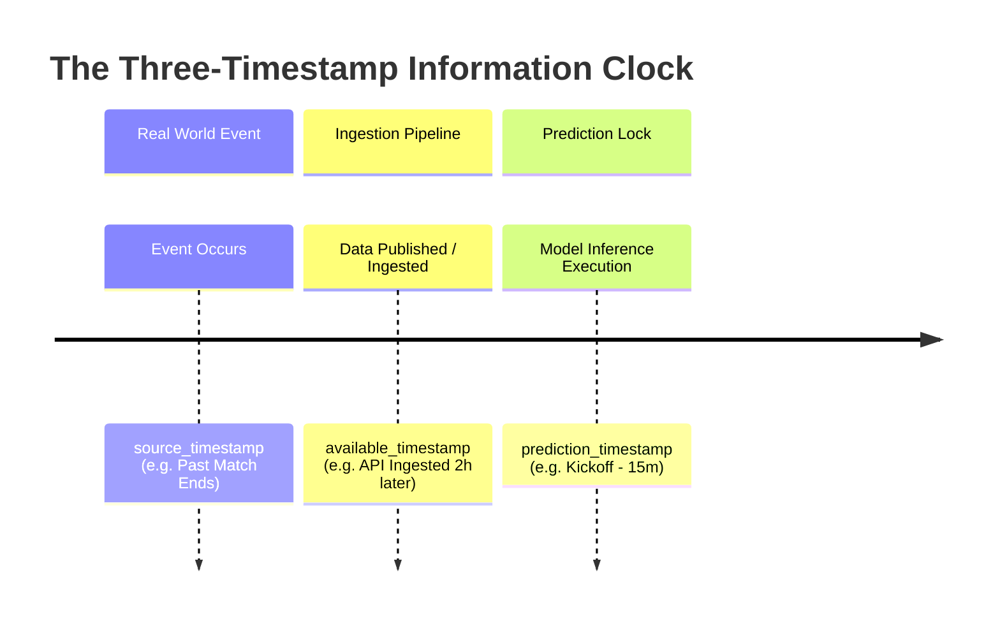

# 06 — Leakage Audit: Information Clock Architecture & Causal Invariants

## 1. Executive Summary

Data leakage is the single most catastrophic failure mode in sports forecasting machine learning research. A model contaminated with future information will exhibit state-of-the-art in-sample or cross-validated performance (e.g., $RPS < 0.180, \text{Accuracy} > 68\%$), but will immediately collapse when deployed into live prospective operation.

This document establishes the formal **Information Clock Architecture** and **Eight Causal Invariants** governing all $V_5$ dataset construction, feature engineering, and model validation.

---

## 2. The Formal Three-Timestamp Information Clock

Every data point in the $V_5$ pipeline is stamped with three immutable, timezone-aware UTC timestamps:



### Mathematical Invariant Formulation

For any match fixture $M_i$ with scheduled kickoff timestamp $T_{\text{KO}}(M_i)$ and pre-kickoff safety buffer $\Delta_{\text{buffer}}$ (default: $15\text{ minutes}$):

1. **Prediction Cutoff Timestamp**:
   $$T_{\text{cutoff}}(M_i) = T_{\text{KO}}(M_i) - \Delta_{\text{buffer}}$$

2. **Feature Causal Eligibility Condition**:
   A feature $f_j(M_i)$ constructed from historical event $E_k$ is causally valid if and only if:
   $$t_{\text{available}}(E_k) \le T_{\text{cutoff}}(M_i)$$

3. **Strict Causal Assertion**:
   $$\text{If } t_{\text{available}}(E_k) > T_{\text{cutoff}}(M_i) \implies \text{RAISE FATAL LEAKAGE EXCEPTION}$$

---

## 3. The Eight Fatal Leakage Vectors & Concrete Mitigations

### Vector 1: Target Fixture Post-Match Statistic Leakage
- **Mechanism**: Accidentally including in-match statistics (e.g., final shots, red cards, or post-match $xG$ of match $M_i$) in the feature vector for predicting match $M_i$.
- **Severity**: **Catastrophic** (Guarantees false $\sim 100\%$ accuracy).
- **Mitigation Protocol**:
  - The feature builder for match $M_i$ queries only past fixtures satisfying:
    $$\text{fixture\_id} \ne M_i.\text{fixture\_id} \quad \text{AND} \quad \text{kickoff\_utc} < M_i.\text{kickoff\_utc}$$
  - Automated unit test assertion verifying feature values do not correlate with target match post-match events.

---

### Vector 2: Market Closing Odds Horizon Mismatch
- **Mechanism**: Ingesting Closing Odds (recorded at $T_{\text{KO}} - 5\text{m}$) to generate predictions at $T_{\text{KO}} - 24\text{h}$. Closing odds incorporate breaking news (starting XI, warm-up injuries, sharp syndicate money) that did not exist 24 hours prior.
- **Severity**: **Severe** (Overestimates model capability by $\sim 4\text{ to }6\%$ accuracy).
- **Mitigation Protocol**:
  - Segregate market datasets into distinct **Horizon Tiers**:
    - `Opening Market` ($T - 48\text{h}$ to $T - 24\text{h}$)
    - `Mid Market` ($T - 6\text{h}$)
    - `Pre-Kickoff Market` ($T - 15\text{m}$)
  - Models evaluated at horizon $T_{\text{eval}}$ can ONLY ingest odds stamped with $t_{\text{odds}} \le T_{\text{eval}}$.

---

### Vector 3: Confirmed Lineup Pre-Announcement Leakage
- **Mechanism**: Using confirmed starting XI player ratings to predict matches hours before official teamsheets are published (teamsheets are officially submitted exactly 60–75 minutes prior to kickoff in UEFA/top leagues).
- **Severity**: **Severe** (In prospective deployment, starting lineups are completely unknown at $T - 6\text{h}$).
- **Mitigation Protocol**:
  - Lineup-dependent features ($G_1, G_2, F_1$) are strictly quarantined to the **$T - 15\text{m}$ Prediction Horizon**.
  - General pre-match predictions generated at $T - 24\text{h}$ must rely strictly on squad-level ratings and historical regular starters.

---

### Vector 4: Global Preprocessing / Scaling Leakage
- **Mechanism**: Fitting `StandardScaler`, `MinMaxScaler`, `SimpleImputer`, or target encoders on the entire multi-season dataset before partitioning into train and test splits.
- **Severity**: **Moderate/High** (Future distribution statistics leak into historical training).
- **Mitigation Protocol**:
  - All preprocessors must be fitted **strictly on the Training Fold only**:
    $$\text{Scaler}.\text{fit}(X_{\text{train}}) \implies X_{\text{val\_scaled}} = \text{Scaler}.\text{transform}(X_{\text{val}})$$
  - Never call `fit_transform()` on combined dataset.

---

### Vector 5: Non-Chronological / Random Split Leakage
- **Mechanism**: Using standard $K$-fold cross-validation with random shuffling on football time series. Matches from May 2024 train the model that predicts matches from September 2023.
- **Severity**: **Severe** (Future tactical regimes, mid-season transfers, and tactical adaptations leak into past matches).
- **Mitigation Protocol**:
  - **Zero Random Splitting**: 100% of model evaluation must use **Chronological Walk-Forward Rolling-Origin Evaluation** (Train on Seasons $1 \dots K-1$, Validate on Season $K$, Test on Season $K+1$).

---

### Vector 6: Retrospective Rating State Leakage
- **Mechanism**: In sequential rating systems (Elo, Glicko, Online Attack/Defense), updating ratings out of chronological order or including the target match result in the rating before computing pre-match feature vectors.
- **Severity**: **Catastrophic** (Target outcome leaks into feature vector).
- **Mitigation Protocol**:
  - Elo and Online Attack/Defense states use a strict **Two-Pass Execution Architecture**:
    1. **Pass 1 (Pre-Match Read)**: Extract current rating $R_t$ and assign as match feature.
    2. **Pass 2 (Post-Match Update)**: Only after all matches kicking off at $t$ have had features extracted, apply outcome update to transition state $R_t \rightarrow R_{t+1}$.

---

### Vector 7: Out-of-Sample Hyperparameter / Threshold snooping
- **Mechanism**: Tuning hyperparameters, feature subsets, or draw override thresholds (e.g., $V_{4.6}$ gate thresholds) directly on the test set or future validation cohort.
- **Severity**: **High** (Causes optimistic overfitting and in-sample illusion).
- **Mitigation Protocol**:
  - Strict tripartite data partition:
    - **Training Set (Historical)**: Model parameter estimation.
    - **Validation Set (Tuning)**: Hyperparameter selection and threshold discovery.
    - **Test Set / Fresh Prospective Cohort (Frozen Blind Evaluation)**: 100% untouched until model is locked.

---

### Vector 8: Timezone Boundary Misalignment
- **Mechanism**: Comparing local calendar dates directly against UTC ISO dates (e.g. evaluating a match kicking off at `2026-08-22 19:30 UTC` = `2026-08-23 01:00 IST` as an August 22 match, leaking future day fixtures).
- **Severity**: **Operational / Data integrity failure**.
- **Mitigation Protocol**:
  - Standardize all internal comparisons to timezone-aware UTC datetime objects. Local timezone formatting is applied strictly at the presentation layer using `zoneinfo.ZoneInfo("Asia/Kolkata")`.

---

## 4. Automated Causal Verification Harness

To enforce these invariants programmatically, the $V_5$ dataset builder will execute the following automated assertion suite before generating any experimental dataset:

```python
def assert_zero_leakage(
    fixture_id: int,
    kickoff_utc: datetime,
    feature_dict: dict,
    historical_matches: list[dict],
) -> None:
    """Rigorous causal assertion suite for V5 candidate dataset construction."""
    cutoff_time = kickoff_utc - timedelta(minutes=15)
    
    # 1. Target fixture isolation check
    assert feature_dict["fixture_id"] == fixture_id
    
    # 2. Historical event timestamp check
    for event in historical_matches:
        event_time = event["kickoff_utc"]
        assert event_time < kickoff_utc, (
            f"FATAL LEAKAGE: Historical event {event['fixture_id']} timestamp "
            f"({event_time}) is >= target match kickoff ({kickoff_utc})"
        )
        assert event["available_utc"] <= cutoff_time, (
            f"FATAL LEAKAGE: Event {event['fixture_id']} data availability timestamp "
            f"({event['available_utc']}) is after prediction cutoff ({cutoff_time})"
        )
        
    # 3. Target score isolation check
    assert "target_home_goals" not in feature_dict
    assert "target_away_goals" not in feature_dict
    assert "target_actual_result" not in feature_dict
```

---

## 5. Summary Compliance Checklist

| Leakage Risk | Verification Mechanism | Status in $V_5$ Design |
|:---|:---|:---:|
| Target Match Statistics | Primary Key & Chronological Query Isolation | **ENFORCED** |
| Closing Odds Contamination | Multi-Tier Horizon Tagging ($T-24\text{h}, T-15\text{m}$) | **ENFORCED** |
| Lineup Pre-Announcement | Lineup Features Gated Strictly to $T-15\text{m}$ Horizon | **ENFORCED** |
| Cross-Split Scaling Leakage | Split-Isolated Preprocessing Pipelines | **ENFORCED** |
| Random Time Series Splitting | Chronological Rolling Walk-Forward Folds Only | **ENFORCED** |
| Retrospective Rating Updates | Two-Pass Read/Update Architecture | **ENFORCED** |
| Test Set Threshold Snooping | Tripartite Training/Validation/Blind Test Isolation | **ENFORCED** |
| Timezone Misalignment | UTC Unix Internal Bounding + ZoneInfo Presentation | **ENFORCED** |
