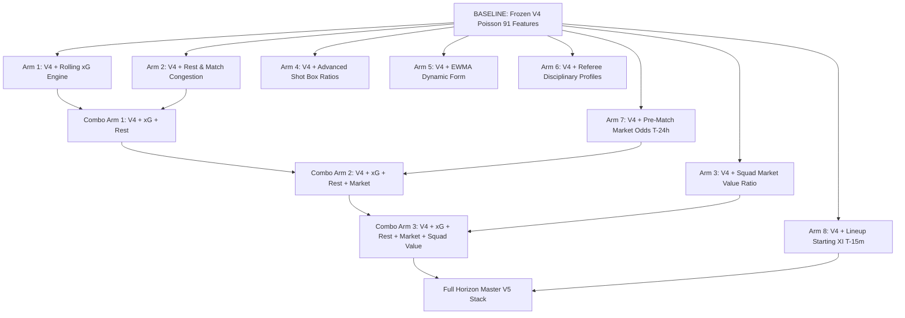

# 08 — Ablation Plan: Systematic Incremental Feature & Layer Study

## 1. Executive Summary

This document specifies the mandatory **Ablation Study Protocol** for the $V_5$ research campaign. To prevent overfitting, feature bloat, and false signal attribution, every candidate feature group and architectural layer must be evaluated through a rigorous **isolated step-by-step ablation harness**.

**Core Principle**: A feature group is NEVER adopted because it improves accuracy on a single season or cherry-picked league. It must demonstrate **statistically significant incremental reduction in Ranked Probability Score ($RPS$) across multiple chronological seasons** under strict walk-forward validation.

---

## 2. Baseline & Incremental Ablation Sequence

---

## 3. Detailed Experimental Arms

### Step 1: Single-Group Ablations (Univariate Additions)

| Arm Code | Experimental Configuration | New Features Added | Mathematical Hypothesis | Target Metric Gain |
|:---|:---|:---:|:---|:---:|
| **$A_0$** | **Frozen $V_4$ Baseline** | 0 (91 cols) | Benchmark invariant anchor | $RPS_0 = 0.20018$ |
| **$A_1$** | $V_4 + \text{Rolling } xG$ | +6 cols ($xG_{\text{EWMA}}, xGA_{\text{EWMA}}, npxG, xG_{\text{diff}}, \Delta_{\text{finish}}, xG_{\text{sum}}$) | $xG$ stabilizes team goal expectation 3x faster than raw goal counts | $\Delta RPS \le -0.0020$ |
| **$A_2$** | $V_4 + \text{Rest / Congestion}$ | +4 cols ($\Delta_{\text{rest}}, ML_{14}, TBI, CRG$) | Physical fatigue reduces away goal intensity in short turnarounds | $\Delta RPS \le -0.0008$ |
| **$A_3$** | $V_4 + \text{Squad Market Value}$ | +2 cols ($MVR, \ln(\text{Squad Value})$) | Financial valuation anchors underlying team talent floor | $\Delta RPS \le -0.0012$ |
| **$A_4$** | $V_4 + \text{Box Shot Ratios}$ | +4 cols ($BSR_{\text{home}}, BSR_{\text{away}}, DCA_{\text{home}}, DCA_{\text{away}}$) | Deep penalty penetration carries higher signal than long shots | $\Delta RPS \le -0.0006$ |
| **$A_5$** | $V_4 + \text{EWMA Dynamic Form}$ | +4 cols (EWMA points, EWMA goal diff, opponent-adjusted) | Continuous half-life decay eliminates arbitrary 5/10 match cliff | $\Delta RPS \le -0.0005$ |
| **$A_6$** | $V_4 + \text{Referee Disciplinary}$ | +3 cols ($RCS, RPR, RHB$) | High-card referees increase penalty and game disruption variance | $\Delta RPS \le -0.0002$ |
| **$A_7$** | $V_4 + \text{Market Odds } (T-24\text{h})$ | +3 cols (Shin Devigged $P_H, P_D, P_A$ at $T-24\text{h}$) | Opening market incorporates syndicate collective intelligence | $\Delta RPS \le -0.0035$ |
| **$A_8$** | $V_4 + \text{Lineup Starting XI } (T-15\text{m})$ | +3 cols (Starting XI Elo, Missing Starters, Formation Indicator) | Confirmed lineups capture tactical surprises minutes before kickoff | $\Delta RPS \le -0.0025$ |

---

### Step 2: Multivariate Combinations (Interaction Testing)

| Combo Code | Combined Feature Set | Core Objective | Key Risk Tested |
|:---|:---|:---|:---|
| **$C_1$** | $V_4 + xG + \text{Rest}$ | Test if physical fatigue interacts positively with chance creation rates | Collinearity between fatigue and $xG$ slump |
| **$C_2$** | $V_4 + xG + \text{Market } (T-24\text{h})$ | Test whether $xG$ provides orthogonal signal beyond market odds | Market redundancy (does market already price $xG$?) |
| **$C_3$** | $V_4 + xG + \text{Rest} + \text{Squad Value}$ | Complete pre-match physical model (zero market dependence) | Feature count explosion / overfitting |
| **$C_4$** | $V_4 + xG + \text{Rest} + \text{Market} + \text{Squad Value}$ | Maximum information pre-match model ($T-24\text{h}$) | Over-reliance on market lines |
| **$C_5$** | $C_4 + \text{Lineups } (T-15\text{m})$ | Full multi-horizon real-time matchday stack | Late-breaking data ingestion failures |

---

### Step 3: Model Architecture Ablation (Fixed Best Feature Set $C_3$)

Once the optimal feature combination is identified, freeze the feature matrix and test structural model engines:

| Model Arm | Architecture Tested | Loss Function | Key Hypothesis |
|:---|:---|:---|:---|
| **$M_0$** | Linear Poisson GLM ($V_4$ Engine) | Poisson NLL | Baseline linear benchmark |
| **$M_1$** | LightGBM Dual Poisson Regressor | Poisson Objective + Bivariate Matrix | Non-linear tree interactions capture subtle goal threshold cliffs |
| **$M_2$** | CatBoost Regressor | Ordered Boosting + Bivariate Matrix | Superior categorical handling for leagues and venues |
| **$M_3$** | LightGBM + Dixon-Coles Matrix | Poisson Objective + Low-Score $\rho$ Correction | Repairs $0-0 / 1-1$ scorelines on top of non-linear $\lambda$ |
| **$M_4$** | Stacked Ensemble (LightGBM + $V_4$ + Market) | Level-1 L2 Logistic Meta-Learner | Blends structural Poisson stability with tree flexibility |

---

## 4. Multi-Metric Evaluation Scorecard per Arm

Every ablation arm is evaluated simultaneously across 14 statistical metrics:

$$\begin{aligned}
\text{Probabilistic Scoring Rules:} & \quad RPS, \; \text{Multiclass Log-Loss}, \; \text{Brier Score} \\
\text{Draw-Specific Metrics:} & \quad \text{Draw Precision}, \; \text{Draw Recall}, \; \text{Draw } F_1, \; \text{Draw Brier Score} \\
\text{Classification Metrics:} & \quad \text{Overall Accuracy}, \; \text{Balanced Accuracy}, \; \text{Home } F_1, \; \text{Away } F_1 \\
\text{Calibration Metrics:} & \quad \text{Expected Calibration Error (ECE)}, \; \text{Brier Reliability Slope} \\
\text{Statistical Significance:} & \quad p\text{-value via 1,000-fold Cluster Bootstrap Resampling}
\end{aligned}$$

---

## 5. Formal Rejection & Pruning Criteria

An experimental feature group or model arm is **IMMEDIATELY REJECTED AND PRUNED** if:
1. **$RPS$ Non-Improvement**: Fails to reduce out-of-sample $RPS$ by at least $\Delta RPS \le -0.0005$ relative to baseline.
2. **Temporal Instability**: Shows metric degradation in $> 1$ of the 5 historical test seasons.
3. **Critical League Degradation**: Causes an $RPS$ increase $> +0.0030$ in any single target league (Premier League, La Liga, Bundesliga, Serie A, Ligue 1).
4. **Draw Destruction**: Decreases Draw $F_1$ score by $> 2.0\%$ absolute or increases Draw Brier Score.
5. **Leakage Vulnerability**: Fails automated causal timestamp verification in `assert_zero_leakage()`.
6. **Complexity Inflation**: Adds $> 10$ parameters with marginal gain ($< 0.0002$ in $RPS$), violating Occam's Razor.
