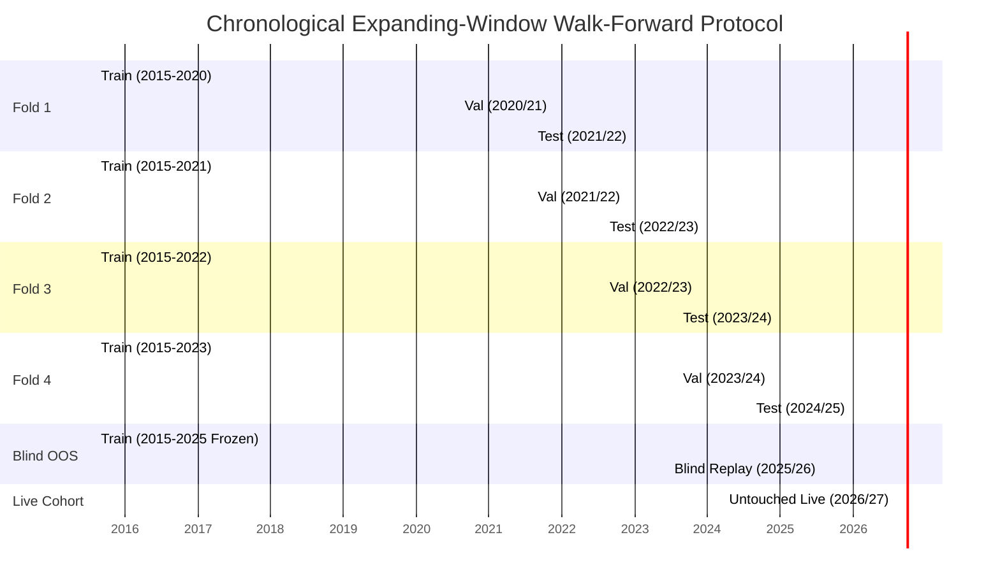
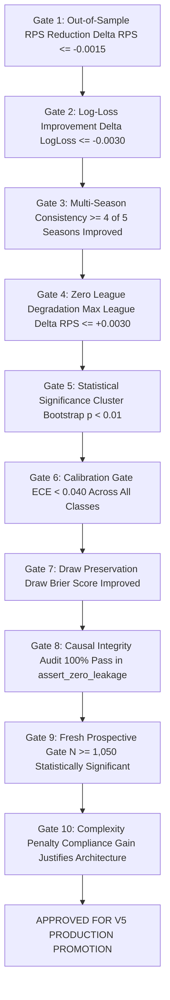

# 09 — Evaluation Protocol: Chronological Walk-Forward & Proper Scoring Rules

## 1. Executive Summary

This protocol governs all experimental evaluation in the $V_5$ research program. Traditional machine learning evaluation methods (such as random $K$-fold cross-validation or train/test splits that ignore match dates) are **strictly prohibited**.

All candidate models must be evaluated via **Chronological Expanding-Window Walk-Forward Cross-Validation** evaluated exclusively with strictly proper scoring rules ($RPS$, Multi-class Log-Loss, Brier Score).

---

## 2. Chronological Walk-Forward Expanding-Window Design

### Partition Definitions

1. **Expanding Training Horizon ($D_{\text{train}}$)**:
   - Contains all historical fixtures up to the end of season $S_{k-2}$.
   - Used strictly for model parameter estimation (GLM coefficients, tree structures, Elo ratings).
2. **Validation Tuning Horizon ($D_{\text{val}}$)**:
   - Season $S_{k-1}$.
   - Used for hyperparameter tuning, feature selection, probability calibration curve fitting, and gate threshold discovery.
3. **Out-of-Sample Test Fold ($D_{\text{test}}$)**:
   - Season $S_k$.
   - Evaluated once using the frozen model fitted on $D_{\text{train}}$ and tuned on $D_{\text{val}}$.
4. **2025/26 Blind Out-of-Sample Holdout ($N = 1,301\text{ matches}$)**:
   - Completely quarantined historical benchmark.
5. **2026/27 Live Prospective Cohort ($N \ge 1,050\text{ fresh fixtures}$)**:
   - Real-time matches captured in `research/v4_promotion/live_v46_prospective.sqlite` before kickoff.

---

## 3. Mathematical Metric Definitions

### Metric 1: Ranked Probability Score ($RPS$) — Primary Optimization Metric
For $K=3$ ordered outcomes ($1 = \text{Home}, 2 = \text{Draw}, 3 = \text{Away}$) with predicted probabilities $p = (p_1, p_2, p_3)$ and observed binary outcome vector $e = (e_1, e_2, e_3)$:

$$RPS = \frac{1}{K-1} \sum_{i=1}^{K-1} \left( \sum_{j=1}^i (p_j - e_j) \right)^2 = \frac{1}{2} \left[ (p_1 - e_1)^2 + (p_1 + p_2 - e_1 - e_2)^2 \right]$$

- **Properties**: Strictly proper scoring rule; sensitive to outcome distance (penalizes predicting Home when Away occurs more severely than predicting Home when Draw occurs).
- **Benchmark Scale**:
  - Naive Uniform ($p = [1/3, 1/3, 1/3]$): $RPS = 0.2222$
  - Naive League Prior ($p = [0.45, 0.26, 0.29]$): $RPS = 0.2078$
  - Current $V_4$ Production: $RPS = 0.20018$
  - State-of-the-Art Target ($V_5$): $RPS < 0.19800$

---

### Metric 2: Multiclass Log-Loss (Cross-Entropy)
$$\text{Log-Loss} = -\frac{1}{N} \sum_{i=1}^N \sum_{k \in \{H, D, A\}} y_{i, k} \ln(p_{i, k})$$
- Strictly proper scoring rule; heavily penalizes overconfident incorrect predictions ($p_{i, \text{actual}} \to 0$).

---

### Metric 3: Multiclass Brier Score
$$\text{Brier Score} = \frac{1}{N} \sum_{i=1}^N \sum_{k \in \{H, D, A\}} (p_{i, k} - y_{i, k})^2$$
- Decomposes into **Reliability (Calibration) - Resolution + Uncertainty**.

---

### Metric 4: Expected Calibration Error ($ECE$)
Partition predicted probabilities into $M=10$ bins $B_m$ for each class $k$:
$$ECE_k = \sum_{m=1}^M \frac{|B_m|}{N} \left| \text{acc}(B_m) - \text{conf}(B_m) \right|$$
- Measures whether a model predicting $70\%$ probability for Home win actually observes Home wins $70\%$ of the time.

---

### Metric 5: Draw-Specific Diagnostics
$$\text{Draw Precision} = \frac{TP_D}{TP_D + FP_D}, \quad \text{Draw Recall} = \frac{TP_D}{TP_D + FN_D}, \quad \text{Draw } F_1 = 2 \cdot \frac{\text{Prec}_D \cdot \text{Rec}_D}{\text{Prec}_D + \text{Rec}_D}$$
$$\text{Draw Brier Score} = \frac{1}{N} \sum_{i=1}^N (P_i(D) - \mathbb{I}(Y_i = D))^2$$

---

## 4. Statistical Significance Testing via Matchweek Cluster Bootstrap

Football match outcomes within the same matchweek share slight environmental correlations (weather patterns, referee pools, league-wide congestion). Therefore, standard independent identically distributed (i.i.d.) bootstrapping is invalid.

**Cluster Bootstrap Protocol**:
1. Cluster matches by `(season, matchweek_id)`.
2. Resample $B = 1,000$ bootstrap datasets by sampling matchweek clusters with replacement.
3. Compute $\Delta RPS = RPS_{\text{Candidate}} - RPS_{\text{Baseline}}$ on each bootstrap replicate $b \in [1, 1000]$.
4. Construct the $95\%$ Confidence Interval: $[\Delta RPS_{2.5\%}, \Delta RPS_{97.5\%}]$.
5. Compute two-tailed bootstrap $p$-value:
   $$p = 2 \cdot \min\left( \frac{1}{B}\sum_{b=1}^B \mathbb{I}(\Delta RPS_b \ge 0), \frac{1}{B}\sum_{b=1}^B \mathbb{I}(\Delta RPS_b \le 0) \right)$$
6. Significance threshold: $p < 0.01$ (Alpha = $1\%$).

---

## 5. The Ten Mandatory Gates for Model Promotion to $V_5$

A candidate model will **ONLY** replace or upgrade the production $V_4$ baseline if it satisfies all 10 non-negotiable criteria:

### The 10 Invariant Promotion Rules:
1. **Gate 1 (Out-of-Sample $RPS$)**: Mean walk-forward test $RPS$ must improve over $V_4$ by at least $\Delta RPS \le -0.00150$.
2. **Gate 2 (Log-Loss)**: Multiclass Log-Loss must improve by at least $\Delta \text{LogLoss} \le -0.00300$.
3. **Gate 3 (Multi-Season Consistency)**: Must show positive improvement in at least $4$ out of the $5$ historical test seasons.
4. **Gate 4 (No League Breakdown)**: No single league among the 5 target competitions may suffer an $RPS$ degradation exceeding $+0.0030$.
5. **Gate 5 (Statistical Significance)**: The 1,000-fold cluster bootstrap $95\%$ CI must strictly exclude zero ($p < 0.01$).
6. **Gate 6 (Probability Calibration)**: Expected Calibration Error ($ECE$) must remain $\le 0.040$ for Home, Draw, and Away.
7. **Gate 7 (Draw Quality)**: Draw Brier Score must improve; Draw $F_1$ must not decline by $> 1.0\%$ absolute.
8. **Gate 8 (Causal Audit)**: 100% pass rate across all automated leakage assertions (`assert_zero_leakage`).
9. **Gate 9 (Fresh Prospective Validation)**: Must demonstrate positive signal on the genuinely fresh prospective cohort ($N \ge 1,050$) before live deployment.
10. **Gate 10 (Occam's Razor)**: If candidate model introduces substantial architectural complexity (e.g. 5 sub-models), the $RPS$ gain must exceed $\Delta RPS \le -0.0030$. If $\Delta RPS \in [-0.0015, -0.0030]$, the simplest viable model is selected.
