# 11 — Top 3 Experiment Plan: Detailed Implementation Blueprints

## 1. Executive Summary

This document specifies the precise experimental blueprints for the **Top 3 High-Priority Research Experiments** designed to advance the Football Prediction Model Lab toward $V_5$.

**Governance Policy**: These experiment plans are strictly research specifications. **No code in production, no baseline assets, and no frozen models will be modified during this design phase**. All experiments will execute in isolated research namespaces under `research/v5_experiments/`.

---

## 2. Top 3 Experiment Overview

```mermaid
graph TD
    subgraph "Experiment 1: Zero-Data-Cost Structural Upgrade"
        E10["E10: Dixon-Coles Joint Matrix + Continuous Parity Gate"]
        E10 -->|Target: Draw Calibration & RPS| R1[Expected Gain: Delta RPS -0.00180]
    end

    subgraph "Experiment 2: High-Signal Feature Pipeline Expansion"
        E11["E11: Causal Expected Goals (xG) & npxG Engine"]
        E11 -->|Target: Team Ability Stabilization| R2[Expected Gain: Delta RPS -0.00220]
    end

    subgraph "Experiment 3: Non-Linear Machine Learning Architecture"
        E12["E12: Dual LightGBM Poisson + Rest Fatigue Engine"]
        E12 -->|Target: Non-linear Interactions & Schedule Cliffs| R3[Expected Gain: Delta RPS -0.00280]
    end
```

---

## 3. Detailed Blueprint: Experiment $E_{10}$ (Dixon-Coles + Continuous Parity Gate)

### A. Objective & Hypothesis
- **Objective**: Upgrade the probability conversion layer of the $V_4$ pipeline by replacing independent Poisson score generation with a vectorized **Dixon-Coles bivariate dependency matrix** and a **Continuous Rating Parity Gate**.
- **Core Hypothesis**: The primary deficiency of $V_4$ is not team strength estimation (which Elo + Online AD capture effectively), but the mathematical independence assumption in the score grid, which suppresses $0-0$ and $1-1$ draws by $\sim 18\%$. Correcting this score dependence will improve Draw $F_1$ and reduce out-of-sample $RPS$ without requiring any new external data.

### B. Input Requirements
- **Data**: Existing historical training seasons (`matches.db`, `features.db`). Zero external data required.
- **Features**: Existing 91 features in $V_4$ contract + derived `abs_elo_diff` and $(\lambda_H, \lambda_A)$.

### C. Mathematical Formulation
1. **Low-Score Interaction Parameter ($\rho$)**:
   Solve for $\rho$ on historical training seasons ($2015\text{–}2024$) via bounded MLE:
   $$\rho^* = \arg\max_{\rho \in [-0.30, 0.0]} \sum_{i=1}^N \ln P_{\text{Dixon-Coles}}(x_i, y_i \mid \lambda_{H, i}, \lambda_{A, i}, \rho)$$
2. **Continuous Rating Parity Index ($RPI$)**:
   $$RPI = \exp\left(-\frac{\text{abs\_elo\_diff}^2}{2 \cdot 55.0^2}\right)$$
3. **Probability Matrix Transformation**:
   Generate the $15 \times 15$ probability matrix $M_{x, y} = \tau(x, y) \cdot \text{Pois}(x \mid \lambda_H) \cdot \text{Pois}(y \mid \lambda_A)$, normalize over the grid, and derive $(P_H, P_D, P_A)$.

### D. Step-by-Step Execution Plan
1. Create `research/v5_experiments/e10_dixon_coles_parity/`.
2. Implement vectorized Dixon-Coles joint probability generator in Python/NumPy.
3. Run walk-forward expanding window across 5 historical folds.
4. Evaluate 2025/26 Blind Out-of-Sample Holdout ($N = 1,301$).
5. Compute multi-class $RPS$, Log-Loss, Draw Brier Score, and 1,000-fold cluster bootstrap confidence intervals.

### E. Safety & Causal Invariants
- Parameter $\rho^*$ fitted strictly on training partition $D_{\text{train}}$ before test fold evaluation.
- $V_4$ Poisson weights remain 100% frozen and unmodified.

---

## 4. Detailed Blueprint: Experiment $E_{11}$ (Causal Expected Goals Engine)

### A. Objective & Hypothesis
- **Objective**: Ingest open historical match-level and shot-level Expected Goals ($xG, xGA, npxG$) from 2014/15 to 2026 across all five target leagues, and construct a causally lagged rolling $xG$ feature engine.
- **Core Hypothesis**: $xG$ reduces noise in goal expectation estimation by $60\%$ compared to raw historical goal counts. Incorporating rolling $xG$ differentials and finishing overperformance ($\Delta_{\text{finish}} = \text{Goals} - xG$) will significantly improve early-season predictability and eliminate false signals caused by lucky/unlucky scorelines.

### B. Input Requirements
- **Data Source**: Understat Open Data archive (2014/15 to 2025/26, 12 seasons across 5 leagues, $\approx 22,000\text{ matches}$).
- **Target Output**: `data/research/understat_xg_causal.parquet`.
- **New Feature Columns (6 features)**:
  1. `home_xg_ewma_last5`
  2. `away_xg_ewma_last5`
  3. `home_xga_ewma_last5`
  4. `away_xga_ewma_last5`
  5. `xg_diff_last5`
  6. `npxg_diff_last10`

### C. Mathematical Formulation
$$\text{Rolling } xG_t = \frac{\sum_{k=1}^N e^{-\alpha (t - t_k)} xG_k}{\sum_{k=1}^N e^{-\alpha (t - t_k)}}, \quad \text{where } \alpha = \frac{\ln(2)}{5\text{ matches}}$$

### D. Step-by-Step Execution Plan
1. Create `research/v5_experiments/e11_expected_goals/`.
2. Build automated ingestion script `ingest_understat_xg.py` with strict team aliasing and date normalization.
3. Compile causal rolling $xG$ features with mandatory `assert_zero_leakage()` verification.
4. Train $V_{4+xG}$ model on historical folds (2015–2024).
5. Compare $V_{4+xG}$ directly against $V_4$ Baseline across all 5 test seasons.

---

## 5. Detailed Blueprint: Experiment $E_{12}$ (Dual LightGBM Poisson + Rest Fatigue)

### A. Objective & Hypothesis
- **Objective**: Implement a modern tree-based non-linear goal intensity architecture using dual LightGBM Poisson models and integrate schedule fatigue features (rest delta, 14-day match load).
- **Core Hypothesis**: Linear Poisson regression fails to capture non-linear tipping points (e.g. extreme fatigue interacting with travel distance and opponent pressing). LightGBM Poisson trees will capture these multi-way interactions while natively preserving Poisson intensity properties.

### B. Input Requirements
- **Features**: Full candidate feature matrix (91 $V_4$ features + 6 $xG$ features + 4 Rest/Fatigue features).
- **Fatigue Features**:
  1. `rest_days_diff`: Home rest days minus Away rest days.
  2. `match_load_14d_away`: Total matches played by Away team in previous 14 days.
  3. `is_short_turnaround_away`: Binary flag ($\le 3\text{ days rest}$).
  4. `travel_distance_km`: Estimated stadium-to-stadium travel distance.

### C. Mathematical Formulation
Dual tree ensembles minimizing Poisson negative log-likelihood:
$$\mathcal{L}(\theta) = \sum_{i=1}^N \left( \hat{\lambda}_i(\theta) - y_i \ln \hat{\lambda}_i(\theta) \right) + \frac{1}{2} \lambda \|\theta\|_2^2 + \gamma T$$
Hyperparameters constrained to prevent overfitting:
`max_depth=4, num_leaves=15, min_child_samples=50, learning_rate=0.03, colsample_bytree=0.75`.

### D. Step-by-Step Execution Plan
1. Create `research/v5_experiments/e12_lightgbm_fatigue/`.
2. Build `src/features/schedule_fatigue.py` generating deterministic calendar rest metrics.
3. Train dual LightGBM regressors for $(\lambda_H, \lambda_A)$.
4. Pipe $(\hat{\lambda}_H, \hat{\lambda}_A)$ through the Dixon-Coles joint matrix from $E_{10}$.
5. Run full chronological walk-forward benchmark against $V_4$ and $E_{10}$.

---

## 6. Top 3 Experiment Comparison Matrix

| Experiment | Focus Area | External Data Cost | Implementation Complexity | Primary Gate Metric Target | Expected Time to Execute |
|:---:|:---|:---:|:---:|:---:|:---:|
| **$E_{10}$** | Probability Matrix & Draw Gate | **$0 (Zero new data)** | Low (Pure math / NumPy) | $\Delta RPS \le -0.00180$ | 1–2 days |
| **$E_{11}$** | Expected Goals ($xG$) Ingestion | **$0 (Open Understat)** | Moderate (Ingestion & Aliasing) | $\Delta RPS \le -0.00220$ | 2–3 days |
| **$E_{12}$** | Non-Linear GBDT + Fatigue | **$0 (Calendar Schedule)** | Moderate (LightGBM tuning) | $\Delta RPS \le -0.00280$ | 3–4 days |
