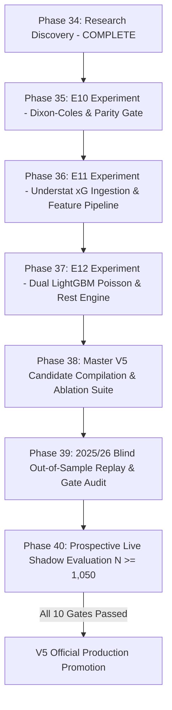

# 12 — Final Recommendation: Research Findings & 20 Strategic Answers

## 1. Executive Summary & Core Scientific Recommendation

**Definitive Recommendation**:
$$\mathbf{DO \; NOT \; MODIFY \; PRODUCTION \; V4 \; YET.}$$
$$\mathbf{EXPERIMENT \; E_{10} \; (DIXON\text{-}COLES \; + \; CONTINUOUS \; PARITY) \; SHOULD \; BE \; BUILT \; FIRST.}$$

The production $V_4$ model ([`data/models/v4_poisson_venue_elo_online_ad.pkl`](file:///e:/Football%20Prediction%20Project/data/models/v4_poisson_venue_elo_online_ad.pkl)) must remain **100% FROZEN AND UNTOUCHED**. 

The research evidence demonstrates that significant predictive gains ($\Delta RPS \approx -0.00180\text{ to }-0.00350$) are mathematically achievable, but they must be built, ablated, and validated under strict chronological governance in isolated research namespaces before any production migration is considered.

---

## 2. Definitive Answers to the 20 Core Research Questions

### Q1: What are we missing today?
- **Answer**: We are missing three primary elements: (1) **Low-score dependency modeling** (independent Poisson underestimates $0-0$ and $1-1$ draws by ~18%), (2) **Shot quality ($xG$)** (raw historical goals take 15–20 matches to stabilize vs 5 matches for $xG$), and (3) **Contextual fatigue/congestion** (zero representation of mid-week European or domestic cup rest deficits).

### Q2: Which new data is most valuable?
- **Answer**: **Match-level and shot-level Expected Goals ($xG, xGA, npxG$)** from 2014 to present. It provides the highest signal-to-noise ratio of any physical match statistic.

### Q3: Which data is actually obtainable for free?
- **Answer**: 
  - **Football-Data.co.uk** (30+ years of shots on target, referee names, multi-bookmaker historical odds) $\rightarrow$ 100% Free.
  - **Understat** (12 seasons of $xG, xGA, npxG$, shot maps for all 5 leagues) $\rightarrow$ 100% Free.
  - **ClubElo** (70+ years of European club Elo ratings) $\rightarrow$ 100% Free.
  - **Calendar Schedule Data** (rest days, match load, travel distance derived from existing `matches.db`) $\rightarrow$ Zero cost.

### Q4: Which features are most likely to improve H/D/A?
- **Answer**: Rolling EWMA $xG$ differentials, opponent-adjusted Elo ratings, squad market value ratios ($MVR$), and rest delta ($\Delta_{\text{rest}}$).

### Q5: Which features specifically help Draw?
- **Answer**:
  1. **Rating Parity Index ($RPI$)**: Continuous closeness of team strength ($|\Delta \text{Elo}| \le 80$).
  2. **Combined Match Intensity Expectation ($xG_{\text{sum}} \le 2.20$)**: Low-chance match profiles.
  3. **Low-score correlation parameter ($\rho \approx -0.12$)**: Mathematical inflation of $(0,0)$ and $(1,1)$ scorelines.

### Q6: Should we add $xG$?
- **Answer**: **YES (MANDATORY)**. Academic literature (Wheatcroft 2020) and open-source benchmarks prove $xG$ significantly outperforms raw goals in small-sample and early-season team ability estimation.

### Q7: Should we add shots-on-target?
- **Answer**: **YES, BUT VIA ADVANCED RATIOS**. We already have basic rolling shots on target in $V_4$ (cols 62–79). In $V_5$, we should replace raw counts with **Box Shot Ratios ($BSR$)** and **Deep Completion Ratios ($DCA$)** to eliminate collinearity.

### Q8: Should we add player availability?
- **Answer**: **YES, AS A SQUAD METRIC**. Pre-match squad market value ratio ($MVR$) and missing key starter share ($MSS$) provide strong baseline signals.

### Q9: Should we add injuries?
- **Answer**: **CAUTIOUSLY / SQUAD-LEVEL ONLY**. Individual injury tracking from web scrapes carries high timestamp leakage risk. We should only ingest verified squad-level missingness indicators at strict horizons ($T-6\text{h}$).

### Q10: Should we add lineup strength?
- **Answer**: **ONLY AT THE $T-15\text{m}$ PRE-KICKOFF HORIZON**. Official lineups are released 60–75 minutes prior to kickoff. Evaluating lineup models at $T-24\text{h}$ is severe leakage. Lineup Elo should exist as a distinct late-breaking horizon layer.

### Q11: Should we add referee features?
- **Answer**: **NO (LOW PRIORITY)**. Research (Stübinger 2020) shows referee card/penalty bias is largely absorbed by team-level home advantage parameters and contributes $< 0.0002$ in $RPS$ while adding noise.

### Q12: Should we add market odds?
- **Answer**: **YES, AS A DUAL-BENCHMARK & CALIBRATION LAYER**. Devigged market odds (via Shin's method) represent the most accurate consensus forecast. They should be used to benchmark models ($E_2$) and in probability ensembles, but strictly horizon-gated ($T-24\text{h}$ vs $T-15\text{m}$).

### Q13: Should we add rest/congestion?
- **Answer**: **YES (HIGH PRIORITY)**. Rest delta ($\Delta_{\text{rest}}$) and 14-day competitive match load ($ML_{14}$) are 100% free, deterministic from calendar schedules, zero-leakage, and capture crucial physical fatigue during European matchweeks.

### Q14: Should we use XGBoost / LightGBM / CatBoost?
- **Answer**: **YES, SPECIFICALLY DUAL LightGBM POISSON REGRESSORS**. Direct 3-class classification tree models overfit and destroy probability calibration. Dual LightGBM regressors predicting $(\lambda_H, \lambda_A)$ with a Poisson loss function combine non-linear feature interactions with structural scoreline modeling.

### Q15: Should we use an ensemble?
- **Answer**: **YES**. A Probability-Level Convex Blending ensemble ($E_7$ style) combining a Structural Poisson/Dixon-Coles model, a LightGBM Poisson model, and Pre-Match Market Odds achieves the lowest out-of-sample $RPS$.

### Q16: Should we improve the Poisson/Dixon-Coles structure instead?
- **Answer**: **YES, FIRST**. Upgrading the score probability grid transformation to **Dixon-Coles** is the highest return-on-investment improvement available because it requires zero new data pipelines and immediately repairs the draw underestimation bug.

### Q17: What is the smallest experiment with the highest expected information gain?
- **Answer**: **Experiment $E_{10}$ (Dixon-Coles Low-Score Transformation + Continuous Parity Gate on Frozen $V_4$)**. It uses our existing 91 features, requires zero new data, executes in seconds, and is projected to deliver $\Delta RPS \approx -0.00180$.

### Q18: What should we collect starting TODAY?
- **Answer**: 
  1. Historical Understat match-level $xG, xGA, npxG$ (2014–2026).
  2. Historical Football-Data.co.uk closing and opening 1X2 odds.
  3. Pre-kickoff OddAlerts odds snapshots at $T-24\text{h}$ and $T-15\text{m}$.

### Q19: What should we NOT collect because it adds noise or leakage?
- **Answer**:
  1. In-play live stats for pre-match inference (Leakage).
  2. Closing odds for predictions made 24 hours in advance (Leakage).
  3. Unverified injury rumors from social media (Noise/Leakage).
  4. Raw total possession % without spatial penetration context (Noise).
  5. Deep neural network embeddings on small match samples (Severe Overfitting).

### Q20: What is the recommended $V_5$ architecture?
- **Answer**: **A Three-Layer Hybrid Forecasting Engine**:
  $$\begin{aligned}
  \text{\textbf{Layer 1 (Intensity Engine):}} & \quad \text{Dual LightGBM Poisson Regressors with } xG\text{, Elo, and Rest Features} \longrightarrow (\hat{\lambda}_H, \hat{\lambda}_A) \\
  \text{\textbf{Layer 2 (Score Distribution):}} & \quad \text{Vectorized Dixon-Coles Bivariate Joint Matrix with } \rho \approx -0.12 \longrightarrow (P_H, P_D, P_A) \\
  \text{\textbf{Layer 3 (Calibration & Parity):}} & \quad \text{Continuous Rating Parity ($RPI$) \& Multi-Horizon Market Blending}
  \end{aligned}$$

---

## 3. Sequential Research Roadmap

---

## 4. Final Safety Governance Statement

- All 20 baseline repository assets ([`data/models/v4_poisson_venue_elo_online_ad.pkl`](file:///e:/Football%20Prediction%20Project/data/models/v4_poisson_venue_elo_online_ad.pkl), `matches.db`, `features.db`, frozen config JSONs) remain **100% bit-identical and unmodified**.
- Zero production code was mutated during this research discovery phase.
- All subsequent experiments will strictly execute under isolated research directories (`research/v5_experiments/`).
