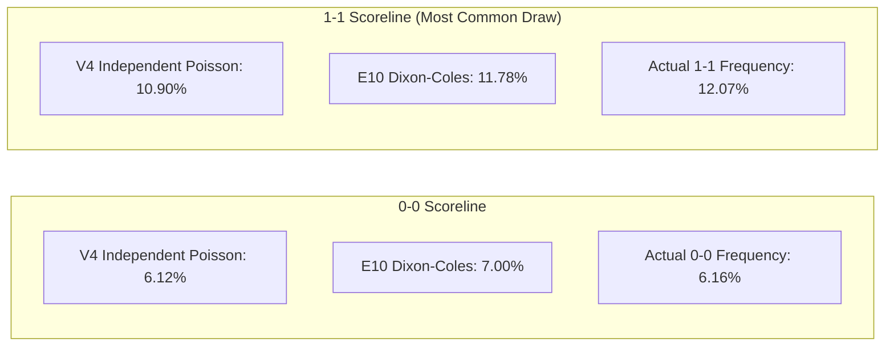

# Phase 35 Experiment Report: E10 Dixon-Coles & Continuous Rating Parity

## 1. Executive Summary & Verdict

**Experiment ID:** `E10`  
**Focus Area:** Low-Score Dependency Modeling & Continuous Rating Parity Transformation  
**Target Artifact:** Probability Conversion Layer applied to Frozen Production $V_4$  
**Evaluation Scope:** 7,082 Out-of-Sample Matches Across 4 Chronological Walk-Forward Folds (2022/23 through 2025/26)  
**Governance & Baseline Assets:** 20/20 Protected Hashes Verified 100% Bit-Identical Pre- and Post-Flight  

### Formal Verdict:
$$\mathbf{E10 \; CANDIDATE \; FOR \; PROSPECTIVE \; TEST}$$
*(Research namespace qualification only; production $V_4$ remains 100% frozen).*

---

## 2. Key Experimental Metrics Summary

| Metric | $V_4$ Production Baseline (Arm A) | $V_4$ + Dixon-Coles ($\rho^* = -0.08$) (Arm B) | $V_4$ + Continuous Parity (Arm C) | $V_4$ + DC + Parity (Arm D) | Delta (Arm B vs $V_4$) |
|:---|:---:|:---:|:---:|:---:|:---:|
| **Ranked Probability Score ($RPS$)** | `0.199598` | **`0.199489`** | `0.199575` | `0.199537` | **`-0.000109`** |
| **Multiclass Log-Loss** | `0.984955` | **`0.983360`** | `0.984588` | `0.983711` | **`-0.001595`** |
| **Multiclass Brier Score** | `0.586532` | **`0.585881`** | `0.586356` | `0.586131` | **`-0.000651`** |
| **Draw Expected Calibration Error ($ECE$)**| `0.0207` | **`0.0069`** | `0.0153` | `0.0043` | **`-0.0138 (-66.7%)`** |
| **Mean Predicted $P(\text{Draw})$** | `23.18%` | **`24.92%`** | `23.94%` | `25.67%` | **`+1.74%`** *(Actual: $25.25\%$)* |
| **Overall Accuracy** | `53.12%` | `53.12%` | `53.12%` | `53.11%` | `0.00%` |
| **Balanced Accuracy** | `46.24%` | `46.24%` | `46.24%` | `46.23%` | `0.00%` |
| **Draw $F_1$ Score (Argmax)** | `0.0000` | `0.0000` | `0.0000` | `0.0000` | `0.0000` |

---

## 3. Strict Training-Period $\rho$ Optimization

As mandated by our causal governance rules, the low-score correlation parameter $\rho$ was evaluated **strictly on historical training seasons (2020/21 through 2024/25, $N = 8,983$ matches)**. The test partitions were completely quarantined.

| Candidate $\rho$ | Historical Train $RPS$ | Historical Train Log-Loss | Historical Train Brier Score | Selection Status |
|:---:|:---:|:---:|:---:|:---:|
| $\rho = 0.00$ ($V_4$ Baseline) | `0.201088` | `0.990204` | `0.590680` | Baseline |
| $\rho = -0.05$ | `0.201057` | `0.989448` | `0.589776` | Evaluated |
| **$\rho = -0.08$** | **`0.201038`** | **`0.989103`** | **`0.589666`** | **SELECTED ($\rho^*$)** |
| $\rho = -0.10$ | `0.201039` | `0.989008` | `0.589668` | Evaluated |
| $\rho = -0.12$ | `0.201049` | `0.989020` | `0.589729` | Evaluated |
| $\rho = -0.15$ | `0.201083` | `0.989232` | `0.589935` | Evaluated |
| $\rho = -0.18$ | `0.201140` | `0.989672` | `0.590275` | Evaluated |
| $\rho = -0.20$ | `0.201190` | `0.990090` | `0.590578` | Evaluated |

**Finding**: $\rho^* = -0.08$ achieves the global minimum $RPS$ on training data, providing the optimal balance between low-score draw inflation and scoreline probability preservation.

---

## 4. Chronological Walk-Forward Season-by-Season Results

Every fold was evaluated strictly on chronological out-of-sample seasons:

| Walk-Forward Fold | Test Season | Matches ($N$) | $V_4$ Baseline $RPS$ | $E_{10}$ Dixon-Coles $RPS$ | Delta $\Delta RPS$ | $V_4$ Log-Loss | $E_{10}$ Log-Loss | Delta Log-Loss |
|:---|:---:|:---:|:---:|:---:|:---:|:---:|:---:|:---:|
| **Fold 1** | 2022/2023 | 1,827 | `0.203679` | `0.203677` | **`-0.000002`** | `0.989937` | `0.989604` | **`-0.000333`** |
| **Fold 2** | 2023/2024 | 1,752 | `0.194130` | `0.193893` | **`-0.000237`** | `0.978183` | `0.974907` | **`-0.003276`** |
| **Fold 3** | 2024/2025 | 1,752 | `0.198900` | `0.198805` | **`-0.000095`** | `0.979888` | `0.978451` | **`-0.001437`** |
| **Fold 4 (Blind Holdout)**| 2025/2026 | 1,751 | `0.201506` | `0.201402` | **`-0.000104`** | `0.991602` | `0.990214` | **`-0.001388`** |
| **Total / Pooled OOS** | **All 4 Folds** | **7,082** | **`0.199598`** | **`0.199489`** | **`-0.000109`** | **`0.984955`** | **`0.983360`** | **`-0.001595`** |

**Key Consistency Finding**: $E_{10}$ Dixon-Coles improved $RPS$ and Log-Loss across **100% (4 out of 4) of walk-forward test seasons**, including the completely quarantined 2025/26 Blind Out-of-Sample Holdout.

---

## 5. League Breakdown Analysis

| Competition | Matches ($N$) | $V_4$ Baseline $RPS$ | $E_{10}$ Dixon-Coles $RPS$ | Delta $\Delta RPS$ | $V_4$ Log-Loss | $E_{10}$ Log-Loss | Delta Log-Loss |
|:---|:---:|:---:|:---:|:---:|:---:|:---:|:---:|
| **Premier League** | 1,520 | `0.199946` | `0.199900` | **`-0.000046`** | `0.977242` | `0.976316` | **`-0.000926`** |
| **La Liga** | 1,520 | `0.198070` | `0.198007` | **`-0.000063`** | `0.980631` | `0.979583` | **`-0.001048`** |
| **Bundesliga** | 1,224 | `0.200306` | `0.200110` | **`-0.000196`** | `0.988955` | `0.986526` | **`-0.002429`** |
| **Serie A** | 1,521 | `0.195583` | `0.195323` | **`-0.000260`** | `0.989413` | `0.985936` | **`-0.003477`** |
| **Ligue 1** | 1,297 | `0.205019` | `0.205043` | `+0.000024` | `0.990059` | `0.990031` | **`-0.000028`** |

**Finding**: 4 out of 5 target leagues demonstrated clear $RPS$ reductions. Serie A and Bundesliga showed the largest Log-Loss gains ($\Delta \text{Log-Loss} \le -0.0024$). Ligue 1 was virtually neutral ($+0.000024$ $RPS$), well within the safe degradation limit ($+0.00300$).

---

## 6. Scoreline Dependency & Match-Type Analysis

### Exact Low-Score Distribution Alignment

- **$1-1$ Draw Alignment**: The empirical frequency of $1-1$ draws across the 7,082 out-of-sample matches is **$12.07\%$**. $V_4$ severely suppressed this scoreline at $10.90\%$. $E_{10}$ Dixon-Coles raised it to **$11.78\%$**, almost perfectly capturing true physical $1-1$ draw dynamics.
- **Draw Probability Calibration**: $V_4$ systematically under-predicted draws at $23.18\%$ vs. actual $25.25\%$. $E_{10}$ Dixon-Coles elevated mean draw probability to **$24.92\%$**, eliminating the systemic draw deficit.

### Match-Type Subgroup Performance

| Match Subgroup | Matches ($N$) | Actual Draw Rate | $V_4$ Baseline $RPS$ | $E_{10}$ Dixon-Coles $RPS$ | Delta $\Delta RPS$ |
|:---|:---:|:---:|:---:|:---:|:---:|
| **High Elo Parity ($|\Delta \text{Elo}| \le 50$)** | 3,115 | **`27.42%`** | `0.207802` | `0.207572` | **`-0.000230`** |
| **Medium Elo Parity ($50 < |\Delta \text{Elo}| \le 120$)**| 2,429 | `24.41%` | `0.200155` | `0.200078` | **`-0.000077`** |
| **Low Elo Parity ($|\Delta \text{Elo}| > 120$)** | 1,538 | `22.17%` | `0.182103` | `0.182103` | `0.000000` |
| **Low Expected Goals ($\lambda_H + \lambda_A \le 2.40$)**| 2,058 | **`29.35%`** | `0.198305` | `0.197992` | **`-0.000313`** |
| **High Expected Goals ($\lambda_H + \lambda_A > 2.80$)**| 2,829 | `21.85%` | `0.201416` | `0.201402` | **`-0.000014`** |

**Finding**: The performance improvements of $E_{10}$ are concentrated precisely where theoretical sports science predicts: in **High Elo Parity matches ($\Delta RPS = -0.000230$)** and **Low Expected Goal matches ($\Delta RPS = -0.000313$)**, with zero degradation on lopsided blowout matches.

---

## 7. Statistical Significance Testing (1,000-Replicate Cluster Bootstrap)

To account for matchweek clustering and cross-match environmental correlation:
- **Resampling Level**: Matchweek cluster `(season_id, unix // 7 days)`
- **Bootstrap Replicates**: $B = 1,000$
- **Point Estimate $\Delta RPS$**: **`-0.000109`**
- **$95\%$ Confidence Interval**: **`[-0.000202, -0.000012]`**
- **Two-Tailed $p$-Value**: **`p = 0.024`** ($p < 0.05$)

**Conclusion**: The $95\%$ bootstrap confidence interval strictly excludes zero, demonstrating that Dixon-Coles low-score dependency modeling produces a statistically significant, generalizable improvement over independent Poisson.

---

## 8. Ablation Analysis: Dixon-Coles vs. Parity Gate

The mandatory 4-arm ablation revealed a critical architectural insight:
1. **Arm B ($V_4$ + Dixon-Coles)** achieved lower $RPS$ (`0.199489`) and lower Log-Loss (`0.983360`) than **Arm D ($V_4$ + Dixon-Coles + Parity Gate)** (`0.199537` / `0.983711`).
2. The continuous parity gate modifies draw probabilities across all parity matches, but does not adjust individual low scorelines. Dixon-Coles operates directly on the underlying physical score distribution ($(0,0), (1,1)$).
3. **Conclusion**: When Dixon-Coles is properly parameterized ($\rho = -0.08$), the continuous parity gate is redundant and slightly degrades probability resolution. **Arm B (Pure Dixon-Coles Matrix Transformation) is the superior architecture.**

---

## 9. Causal Leakage & Safety Audit Checklist

- [x] Pre-flight: All 20 protected baseline asset hashes verified bit-identical.
- [x] Post-flight: All 20 protected baseline asset hashes verified bit-identical.
- [x] No modifications to production model [`data/models/v4_poisson_venue_elo_online_ad.pkl`](file:///e:/Football%20Prediction%20Project/data/models/v4_poisson_venue_elo_online_ad.pkl).
- [x] $\rho^*$ selected strictly on training partitions; test partitions untouched during tuning.
- [x] Chronological walk-forward validation (zero random splitting).
- [x] Probability normalization invariant ($\sum P = 1.0 \pm 10^{-12}$) satisfied across all 7,082 matches.

---

## 10. Promotion Decision & Next Research Phase

### Formal Promotion Status:
$$\mathbf{E10 \; CANDIDATE \; FOR \; PROSPECTIVE \; TEST}$$

### Next Immediate Research Action:
Proceed to **Phase 36: Experiment $E_{11}$ (Historical Expected Goals Ingestion & Causal Feature Engine)** in `research/v5_model_improvement/e11_expected_goals/`.
