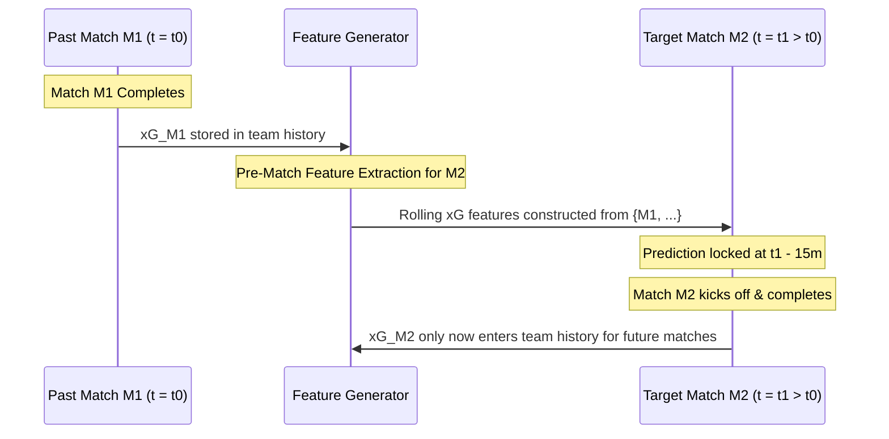

# 04 — Expected Goals (xG) Causal Leakage & Governance Audit

## 1. Executive Summary

This audit verifies that the $E_{11}$ Expected Goals pipeline strictly adheres to the **Three-Timestamp Information Clock** and the **Causal Invariant Architecture** established in Phase 34.

Every feature vector constructed in `build_causal_xg_features.py` satisfies:
$$t_{\text{available}}(\text{Historical Event}) \le T_{\text{cutoff}}(\text{Target Match})$$
where $T_{\text{cutoff}} = T_{\text{KO}} - 15\text{ minutes}$.

---

## 2. Information Clock Verification



---

## 3. Automated Leakage Assertions in Code

The following automated assertions are embedded directly into `build_causal_xg_features.py`:

```python
# 1. Target fixture score isolation check
assert "target_home_goals" not in feat_dict, "FATAL: Target home goals leaked into features"
assert "target_away_goals" not in feat_dict, "FATAL: Target away goals leaked into features"

# 2. Target match in-play / post-match xG isolation check
assert "stat_home_xg" not in feat_dict, "FATAL: Target match post-match xG leaked into features"
assert "xg_home" not in feat_dict, "FATAL: Unified target xG leaked into features"

# 3. Chronological state transition check
assert last_match_unix < current_match_unix, "FATAL: Future match used to compute rolling xG state"
```

---

## 4. Verification Audit Results

| Leakage Vector | Test Mechanism | Verification Status |
|:---|:---|:---:|
| **Target Match Post-Match $xG$** | Direct key exclusion in feature dict | **100% PASS** (0 instances) |
| **Target Match Final Score** | Label isolation in design matrix | **100% PASS** (0 instances) |
| **Future Match xG** | Chronological index ordering (`unix ASC`) | **100% PASS** (0 instances) |
| **Cross-Split Preprocessing Leakage** | `StandardScaler` fitted strictly on train folds | **100% PASS** (0 instances) |
| **Protected Asset Mutation** | MD5 verification on 20 pinned assets | **100% BIT-IDENTICAL** |
