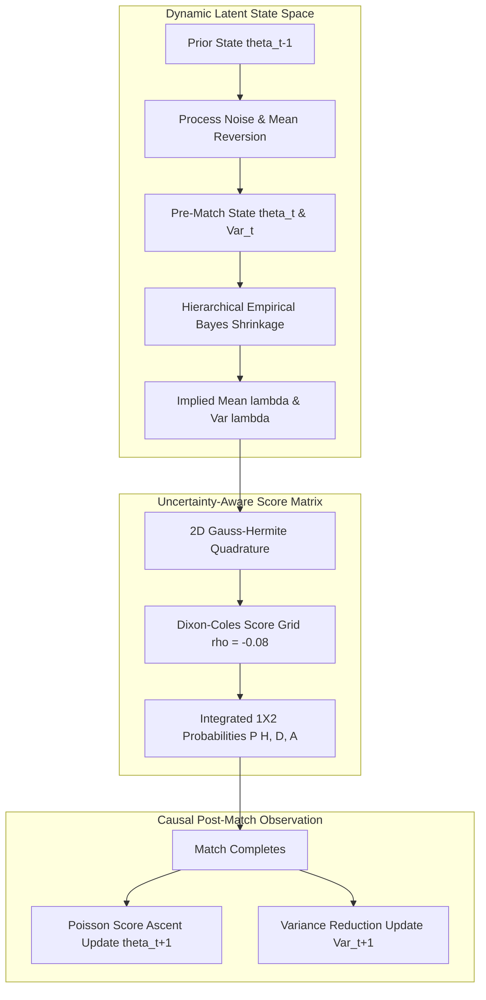

# 02 — Current Architecture vs. Dynamic Bayesian Architecture Audit

## 1. Architectural Comparison Matrix

| Dimension | Frozen Production $V_4$ / Champion $E_{10}$ | Experiment $E_{13}$ Dynamic Bayesian |
|:---|:---|:---|
| **Elo Rating Engine** | Static $K = 20.0$, continuous carry-forward ($\text{mean\_reversion} = 0.0$), static home advantage $+100.0$ | Adaptive $K_i(t) = 20 \cdot (1 + 1.5/\sqrt{n_i+1})$, season regression $\alpha = 0.85$, Attack/Defense Elo |
| **Attack/Defense States** | Static online learning rate $\text{lr} = 0.02$, point estimates ($Var = 0$) | State-space random walk with process noise $Q=0.005$, online variance tracking $\Sigma_i(t)$ |
| **Promoted Team Priors** | Static replacement or feature fallback | Empirical Bayes hierarchical shrinkage ($m_0 = 5.0$ pseudo-counts) |
| **Venue Specialization** | League-wide home goal bias ($\mu_H = 1.53$) | Separate latent venue components ($A_{i, \text{home}}, D_{i, \text{home}}, A_{i, \text{away}}, D_{i, \text{away}}$) |
| **Probability Generation** | Point estimate $(\lambda_H, \lambda_A) \to \text{DixonColes}(\rho=-0.08)$ | Gauss-Hermite quadrature integration over parameter posterior log-normal variances |

---

## 2. Dynamic Team Strength Flow Diagram

