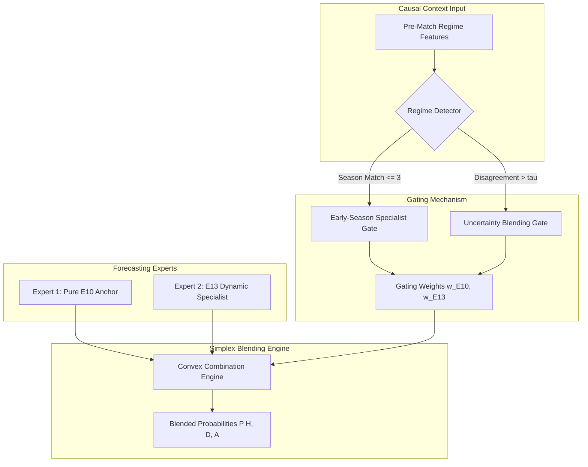

# 05 — Gating Mechanism Architectural Design

## 1. Gating Network Architecture

---

## 2. Mathematical Formulation

$$w_1(x) = \begin{cases} 0.30 & \text{if } \text{season\_match\_num} \le 3 \\ 1.00 & \text{otherwise} \end{cases}, \quad w_2(x) = 1.0 - w_1(x)$$

$$P_{\text{final}}(x) = w_1(x) P_{\text{E10}}(x) + w_2(x) P_{\text{E13}}(x)$$
