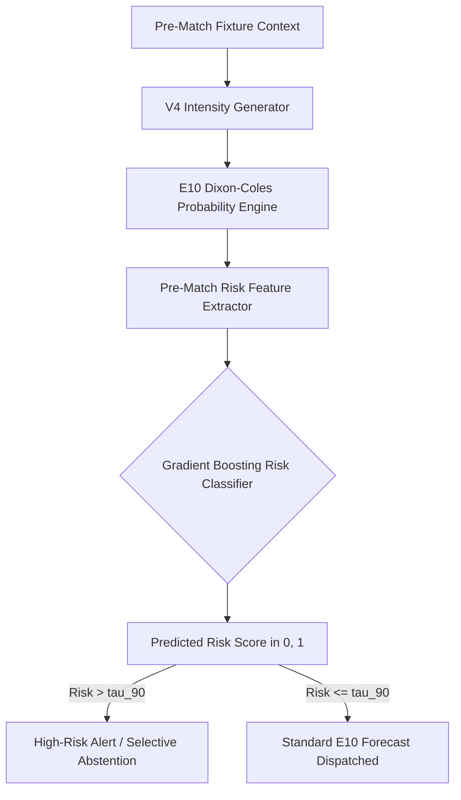

# 05 — Risk Model Architectural Design & Selective Routing

## 1. Meta-Learning Pipeline

---

## 2. Selective Routing Policies

1. **Mode A (Full Coverage)**: Pure $E_{10}$ across all 7,082 matches ($RPS = 0.199489$).
2. **Mode B (Diagnostic Alerting)**: Emits risk flags for top 10% risk fixtures ($N=709$) without altering forecast probabilities.
3. **Mode C (Selective Abstention)**: Abstains from top 10% hardest fixtures ($N=6,373$ retained, $RPS = 0.198354$, $\text{LL} = 0.978088$).
4. **Mode D (Risk Routing to $E_{13}$)**: Dispatches top 10% risk fixtures to $E_{13}$ ($RPS = 0.199561$, degraded).
5. **Mode E (Early Season Routing)**: Dispatches early-season high-risk fixtures to $E_{14}$ ($RPS = 0.199489$).
