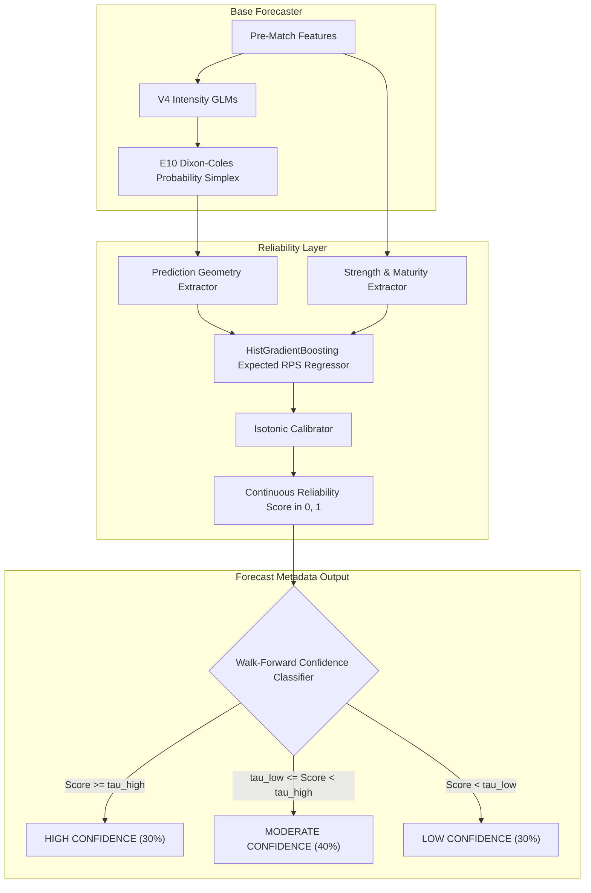

# 05 — Reliability Architecture & Confidence Engine Design

## 1. System Architecture

---

## 2. Confidence Bands

- **HIGH CONFIDENCE**: $N=2,136$ matches ($30.16\%$), Mean Reliability = $0.7247$, Mean RPS = $\mathbf{0.158512}$, Top-1 Accuracy = $\mathbf{66.85\%}$.
- **MODERATE CONFIDENCE**: $N=2,870$ matches ($40.53\%$), Mean Reliability = $0.5751$, Mean RPS = $\mathbf{0.211614}$, Top-1 Accuracy = $\mathbf{48.75\%}$.
- **LOW CONFIDENCE**: $N=2,076$ matches ($29.31\%$), Mean Reliability = $0.5194$, Mean RPS = $\mathbf{0.224887}$, Top-1 Accuracy = $\mathbf{45.04\%}$.
