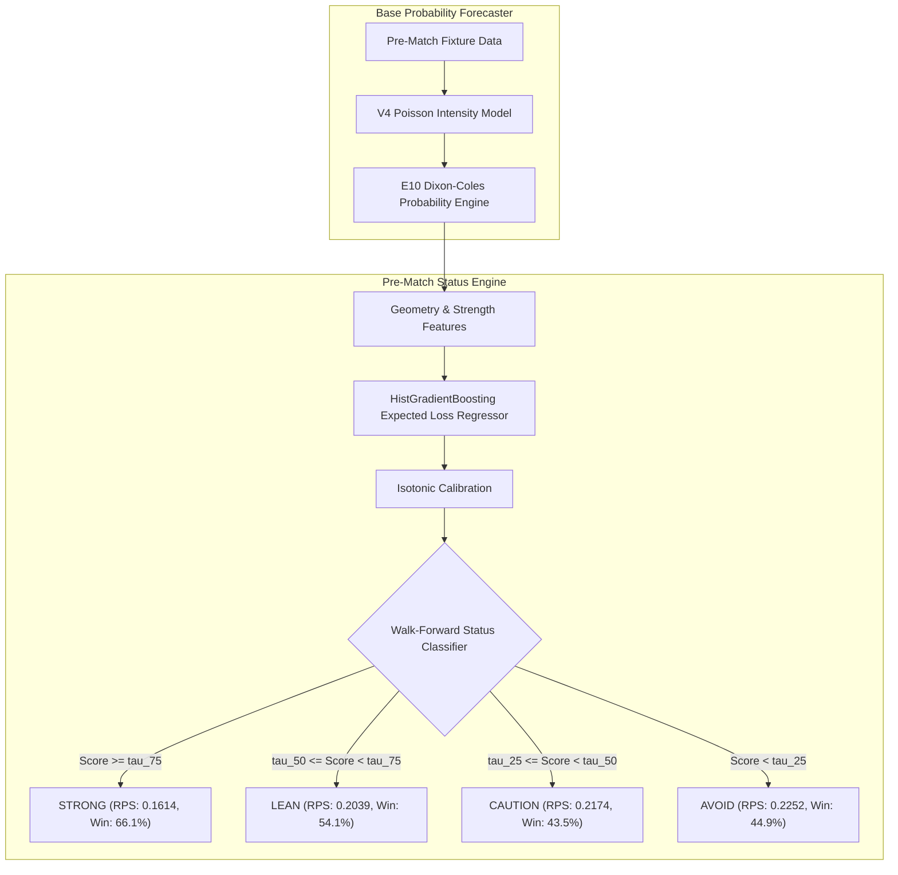

# 05 — Status Taxonomy Design & Decision Engine

## 1. Decision Flow Architecture

---

## 2. Decision Category Definitions & Operational Meaning

1. **STRONG** ($31.64\%$ of fixtures):
   - Clear favorite or strong statistical asymmetry ($P_{\max} \ge 0.65$, Margin $\ge 0.44$).
   - Realized $RPS = \mathbf{0.161384}$, Top-1 outcome win rate = $\mathbf{66.09\%}$.
   - Recommended for high-conviction decision making.

2. **LEAN** ($19.20\%$ of fixtures):
   - Moderate edge ($P_{\max} \approx 0.51$, Margin $\approx 0.24$).
   - Realized $RPS = \mathbf{0.203866}$, Top-1 win rate = $\mathbf{54.12\%}$.
   - Suitable for standard selective coverage.

3. **CAUTION** ($18.20\%$ of fixtures):
   - Unclear matchup with elevated uncertainty ($P_{\max} \approx 0.45$, Margin $\approx 0.17$).
   - Realized $RPS = \mathbf{0.217374}$, Top-1 win rate = $\mathbf{43.52\%}$.
   - High risk of draw or split outcome.

4. **AVOID** ($30.95\%$ of fixtures):
   - Highly volatile / high-entropy 50/50 derbies ($P_{\max} \approx 0.41$, Margin $\approx 0.10$).
   - Realized $RPS = \mathbf{0.225213}$, Log-Loss = $\mathbf{1.066863}$.
   - Recommended for complete selective abstention.
